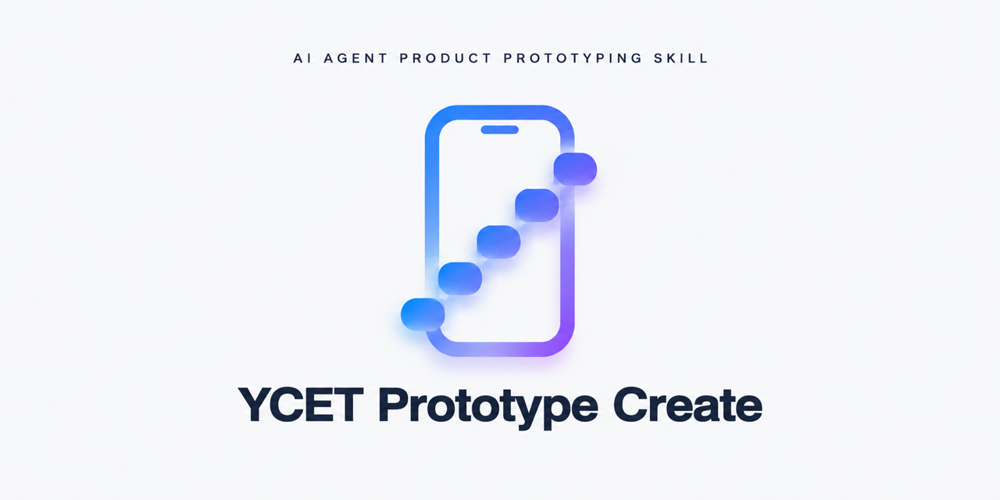
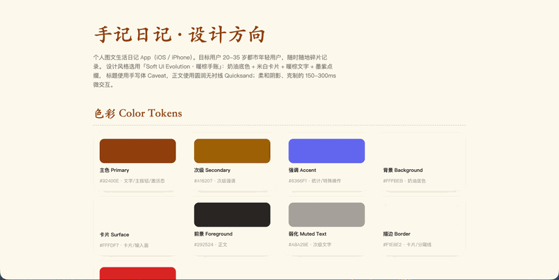
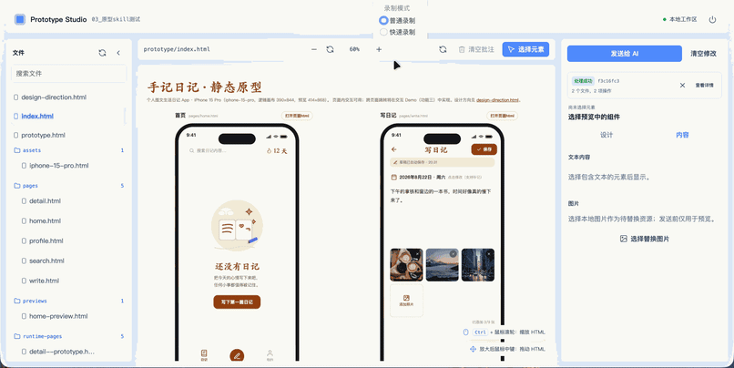

[](README.md)
[](README_en.md)

<div align="center">



# YCET Prototype Create

`ycet-prototype-create` 是一套面向 Codex、Claude Code、OpenCode 等 Agent 的产品原型制作 Skill。它覆盖产品需求澄清、UI 方向确认、高保真静态原型、可视化精准编辑、多页面交互 Demo、已有 HTML/图片原型接管与迁移，以及移动端离线单文件预览。

[](LICENSE)
[](#-快速开始)
[](#-快速开始)
[](../../commits)

</div>

---

# 📚 目录

- [✨ 快速开始](#-快速开始)
- [📖 功能概览](#-功能概览)
- [🎬 演示预览](#-演示预览)
- [🖥️ 工作台架构与生命周期](#️-工作台架构与生命周期)
- [💻 命令行入口](#-命令行入口)
- [🤝 Agent 交接协议](#-agent-交接协议)
- [📁 工作区状态与文件安全](#-工作区状态与文件安全)
- [🔗 五项功能与工作台同步关系](#-五项功能与工作台同步关系)
- [🛡️ 安全规则](#️-安全规则)
- [🧪 环境与验证](#-环境与验证)
- [📄 文档索引](#-文档索引)
- [⚠️ 已知限制与注意事项](#️-已知限制与注意事项)
- [📜 许可证](#-许可证)

---

## ✨ 快速开始

### 安装

将交付目录 `outputs/skills/ycet-prototype-create/` 安装为 Agent Skill：

<details>
<summary>Claude Code / Codex / OpenCode（Windows）</summary>

```powershell
# 以 Claude Code 为例：复制到全局 Skill 目录
Copy-Item -Recurse outputs\skills\ycet-prototype-create $env:USERPROFILE\.claude\skills\ycet-prototype-create
```

</details>

<details>
<summary>macOS / Linux</summary>

```bash
# 以 Claude Code 为例：复制到全局 Skill 目录
cp -r outputs/skills/ycet-prototype-create ~/.claude/skills/ycet-prototype-create
```

</details>

### 使用

在 Agent 会话中触发 `ycet-prototype-create`，按以下流程制作原型：

1. **功能一**：从零散想法或 PRD 生成高保真静态原型（需求澄清 → UI 方向确认 → 静态页面生成）。
2. **功能二**：启动本地工作台，对原型页面做可视化精准修改（元素选择、批注、属性调整、变更包交接）。
3. **功能三**：将已确认的静态页面转换为多页面交互 Demo。
4. **功能四**：接管并迁移已有 HTML 或整页图片原型。
5. **功能五**：打包生成移动端离线单文件原型。

所有原型产物写入用户项目根目录的 `prototype/`，工作台运行状态单独写入用户项目根目录的 `.ycet-editor/`。

---

## 📖 功能概览

本项目把原型制作拆成五个有明确确认门禁的功能。以下边界是强制规则：

- 网页预览、元素选择、批注和属性调整只能生成浏览器会话草稿；发送前不修改磁盘中的 HTML、图片或其他资源。
- 只有 Agent 领取并执行工作台变更包后，才允许修改源文件。
- 外部 HTML 不通过网页按钮添加；需要登记时由用户明确要求 Agent 使用 CLI 的 `ensure --add` 或 `sync --add` 传入绝对路径。
- 文件栏可将已登记 HTML 从工作台移除，但操作需二次确认且绝不删除、移动或重命名磁盘文件；外部 HTML 仍只能由 CLI 显式登记。
- 原型页面的 CSS/JS 必须内联或本地化；禁止将 Tailwind CDN 或其他网络运行时依赖作为交付内容。
- 功能三把静态页面和 `index.html` 当作只读基线，跨页逻辑写入版本专用的 `runtime-pages/` 和 `prototype*.html`。
- 功能五只能新增一个递增命名的 `prototype-mobile*.html`，不能覆盖既有原型、资源、日志或旧手机版文件。

### 功能一：高保真静态原型

从零散想法或 PRD 生成静态高保真原型，产物通常包括：

```text
prototype/
  docs/Spec.md
  docs/EditLog.md
  design-direction.html
  previews/home-preview.html
  index.html
  pages/*.html
  assets/frames/frame-config.json
  assets/frames/<selected-frame>.html
  assets/images/
  assets/icons/
```

流程分为产品需求阶段、UI 方向阶段和静态页面生成阶段。需求阶段只澄清端口、用户、页面、功能、流程、规则和异常，不提前确定视觉风格；UI 方向阶段再根据用户确认选择 UI Skill、色彩、字体、参考和设备框架。静态页面只实现页面内交互，跨页控件只能保留 `data-ycet-nav-target` 意图元数据。

功能一不会启动工作台；用户后续明确选择功能二时，工作台会扫描本次生成的 `design-direction.html`、`pages/**/*.html`、`previews/**/*.html` 与 `index.html`。

### 功能二：原型页面可视化精准修改

功能二用本地工作台替代 F12 手工复制 CSS 选择器和 HTML 路径。工作台直接展示真实 HTML、嵌套 iframe 和运行时页面，用户可选择元素、添加批注、预览属性修改，最后把变更交给 Agent 执行。

只有功能二可以启动工作台；启动与文件刷新时递归扫描项目根目录内的 HTML，并忽略工作台状态、版本控制、依赖、虚拟环境与缓存目录。没有 HTML 时仍启动空工作台，后续可点击左侧刷新按钮补入项目内未展示的文件；刷新也会恢复此前仅从工作台移除、但仍存在于磁盘的项目 HTML。左侧文件树按目录自动分组（例如 `pages`、`runtime-pages`），组内文件相对文件夹标题向右缩进，根级文件不分组，默认按文件名升序显示，并提供搜索、分组折叠、项目文件刷新、侧栏折叠、在新标签页跳转和从工作台移除。跳转与删除图标仅在对应文件行悬浮或键盘聚焦时显示，删除图标为红色。移除仅删除工作区登记，必须二次确认，绝不删除本地 HTML；“清理缺失的文件”仅在存在缺失登记时展示。

中央预览区支持：

- 进入工作台时“选择元素”默认不激活；用户主动点击激活后，悬浮显示蓝色选区框，点击元素显示绿色选区框、元素名称和批注入口；关闭选择模式会清除悬浮框、选区框、元素名称和批注入口。
- 批注入口位于选区框外的右上或右下侧；同一元素已有批注时不再显示新增入口。批注可编辑、删除或在当前 HTML 页面一键清空，批注草稿不会被“清空修改”删除。
- 中央红框区域即内置浏览器窗口，外框在所有缩放比例下都占满全部可用宽高。`Ctrl + 鼠标滚轮`采用浏览器式页面缩放；页面溢出由 HTML 自身滚动。放大到 100% 以上后，鼠标中键通过内部预览层偏移实现不依赖横向滚动条的二维拖动，外框始终不移动。画布左下角常驻对应操作提示。
- 元素滚出当前可视区域、失效或页面滚动时，选区框和悬浮框会重新计算或隐藏，不停留在旧位置。预览运行时上报真实内容宽度和高度，避免页面被固定容器截断。

右侧属性编辑器按当前选中元素刷新，包含：

- 位置：X/Y、旋转角度、顺时针旋转 90 度、水平翻转、垂直翻转；X/Y 以当前视口坐标展示，并以坐标差量叠加到元素原有偏移，因此处于定位容器中的元素数值增加 1 时也只移动 1px；静态元素会转换为可生效的相对定位。
- 布局：宽度、高度，以及按元素类型显示的 Flex/Grid 或定位控制。
- 外观：整体透明度、统一圆角和四角独立圆角。
- 文本：文本 1、文本 2……等文本节点，系统已安装字体族、字体字重、字号、文字颜色、行高、字间距和图标化对齐方式。
- 填充与边框：填充颜色、填充透明度、边框颜色、边框粗细和实线/虚线/点线类型。
- 阴影与模糊：可添加多个外部投影、内部投影、图层模糊或背景模糊效果；每个效果可单独设置、删除和修改投影颜色、位移、模糊、扩散等参数。
- 图片：通过 Python 服务的系统文件选择器选择待替换图片；图片只登记原始绝对路径并用于预览，发送前不复制或改写图片。
- 自定义 CSS：默认允许任意 CSS 属性和值先在预览中应用；Agent 执行时拒绝远程 URL、`@import`、`javascript:`、`expression()`、路径越界和违反功能守卫的值。

工作台的草稿规则：

- 草稿只保存在浏览器内存。切换 HTML 文件时保留各文件草稿，关闭标签页、关闭工作台进程或刷新页面时不保证保留。
- 有修改的文件在左侧文件图标旁显示红点。
- “清空修改”只清当前文件的样式、文本、图片、CSS 和 `同步 pages` 草稿；“清空批注”只清当前文件批注。
- 只有对应 `pages/*.html` 在最近一次 Agent 请求中成功且 SHA-256 确实发生变化时，`runtime-pages/*.html` 才显示“同步 pages”。点击后只生成关联该成功请求的 `sync-pages` 草稿，并在中央画布预览其中可复用的样式、CSS 和文本操作；必须再次发送给 Agent 后才允许写入运行时文件。同步成功后入口隐藏，直到静态页出现新的真实成功修改。Agent 必须保留 `navigate`、`set-screen`、`screen-changed`、页面注册表、目标白名单、事件来源校验和 `prototype.html` 交互。

### 功能三：可交互原型 Demo

将已确认的静态页面转换为多页面交互 Demo：

- `prototype/index.html` 和既有 `prototype/pages/**/*.html` 建立 SHA-256 只读快照。
- 为每个静态页生成同版本的 `runtime-pages/<source>--<demo>.html`，跨页逻辑只写入运行时副本和 `prototype.html`/`prototype-vN.html`。
- `prototype.html`/`prototype-vN.html` 在浏览器默认 100% 缩放下使用独立的自适应 Demo 布局：导航栏宽度保持可读，设备框架按展示区尺寸等比适配且完整可见。
- 通过 `ycet-prototype` 消息协议和 `navigate`、`set-screen`、`screen-changed` 完成双层 iframe 导航中继、页面注册表、返回历史和目标白名单校验。
- 生成功能三产物不会启动工作台；用户后续明确选择功能二时再统一扫描，静态基线仍不修改。
- 生成前后运行 `prototype_guard.py snapshot/verify`；任何受保护静态文件变化都必须停止并报告。

### 功能四：已有 HTML 或图片原型接管与迁移

接管非本 Skill 生成的 HTML 或整页 PNG/JPG 时，必须先确认产品端口，再读取和审计原型。HTML 入口及关联 CSS、JS、图片和字体解析后生成 `prototype/docs/Spec.md`，不调用需求澄清 Skill。确认 Spec 后复用功能一的视觉流程和功能三的交互流程；静态原型完成后必须停止，只有再次获得用户明确确认才生成运行时 Demo。

整页图片必须先保存到 `prototype/assets/images/`，静态承载页和运行时副本均从该目录引用原图。默认不拆图、不 OCR、不把图片重绘成 HTML 元素；只有用户明确确认固定区和滚动区边界时才允许无损分割。图片热区只写入运行时副本，默认透明，悬停或键盘聚焦时显示半透明虚线轮廓。

### 功能五：移动端离线单文件原型

把同一 Demo 版本的运行时页面及其可枚举 CSS、JavaScript、图片、图标和字体依赖打包成一个自包含 `prototype-mobile*.html`：

- 默认全屏显示产品页面，左上角按钮展开覆盖式页面导航抽屉，不显示桌面设备框架和调试信息。
- 对固定像素逻辑画布，离线包在各页面 `srcdoc` 内适配实际手机可视宽高，不改写 `runtime-pages/` 源文件，避免不同手机尺寸裁切内容。
- 复用功能三的消息协议、页面注册表、query/hash 和浏览器返回逻辑。
- 打包前运行工作台锁；有未发送草稿时阻止打包。锁期间可以只读预览，但不能发送新的工作台请求。
- 打包成功只新增一个递增手机版文件，不自动启动或打开工作台；不反向修改 `pages/`、`runtime-pages/`、`index.html`、资源或 `EditLog.md`。
- 动态远程依赖、登录态、路径越界、缺失资源或无法枚举的网络依赖会阻断生成，不用删除页面或资源来“通过”校验。

---

## 🎬 演示预览

以下动图与演示视频为实际产物效果的录制示例（iPhone 15 Pro · 逻辑画布 390×844），内容取自 `prototype/` 目录中的真实产物。

### 功能一 · 高保真静态原型

**UI 设计方案（`design-direction.html`）**



**高保真原型页面（`index.html`）**


### 功能二 · 原型可视化修改工作台



### 功能三 · 可交互原型 Demo（`prototype.html`）


### 功能四 · 已有 HTML 或图片原型接管与迁移

<video src="assets/demos/function-4-demo.mp4" controls></video>

### 功能五 · 移动端离线单文件原型

<video src="assets/demos/function-5-demo.mp4" controls></video>

---

## 🖥️ 工作台架构与生命周期

工作台由以下部分组成：

- `scripts/prototype_workbench.py`：Python 3 标准库本地服务、文件扫描/轮询、系统图片选择器、请求状态、执行事务和功能五锁。
- `assets/workbench/index.html`、`styles.css`、`app.js`：玻璃拟态三栏界面和会话交互。
- `assets/workbench/preview-runtime.js`：以受限同源方式注入预览页面，负责元素指纹、嵌套 iframe、选区、批注、预览草稿、缩放和平移。
- `assets/workbench/icons.svg`：本地 SVG 图标集合，不依赖远程图标服务。

服务只绑定 `127.0.0.1`，使用实例令牌、Host/Origin 校验、路径白名单、安全 MIME 和 CSP。源 HTML 字节不会因预览注入而变化。标准库轮询每秒检查已登记文件摘要和项目内新 HTML；无草稿时刷新预览，有草稿时将外部变化标记为冲突并禁止发送旧草稿。

顶部“关闭工作台进程”按钮使用 Power 图标。点击始终二次确认；有未发送草稿时显示受影响 HTML 文件数量和丢失提示。确认后调用受令牌保护的 `POST /api/shutdown`，服务返回 `202` 后优雅停止 HTTP 服务、文件监听和系统对话框代理，清理当前 PID 对应的 `server.json`。网页不强杀 PID、不自动关闭标签页，也不自动重启。已生成或正在执行的 Agent 请求与结果不会因工作台关闭而删除；下次 `ensure` 会恢复请求状态和结果。

---

## 💻 命令行入口

以下命令均从项目根目录执行，`<skill目录>` 指向 `outputs/skills/ycet-prototype-create`：

### 启动、复用与同步

```powershell
python <skill目录>\scripts\prototype_workbench.py ensure --project-root <项目根目录>
python <skill目录>\scripts\prototype_workbench.py ensure --project-root <项目根目录> --add <HTML绝对路径>
python <skill目录>\scripts\prototype_workbench.py sync --project-root <项目根目录> --add <新增HTML绝对路径>
python <skill目录>\scripts\prototype_workbench.py status --project-root <项目根目录>
```

`ensure` 仅由功能二使用，会复用同一项目的健康实例，实例不存在时才启动随机本机端口。`sync` 仅复用已运行的实例；实例不存在时只更新本地工作区登记，绝不启动或打开浏览器。命令输出 JSON 始终包含 URL（`sync` 未运行时除外）。自动打开浏览器失败或使用 `--no-open` 时，必须把输出 URL 提供给用户手动打开。`--add` 可重复传入；它是登记外部 HTML 的唯一入口，网页端没有对应按钮。

工作台前端使用的核心接口如下，所有接口都要求当前实例令牌，并只接受本机 Host/Origin：

| 方法与路径 | 用途 |
| --- | --- |
| `GET /api/workspace` | 读取当前文件登记、分组、当前文件和缩放偏好 |
| `POST /api/workspace/sync` | 扫描 `prototype/` 并补入新 HTML；不删除磁盘文件 |
| `POST /api/workspace/remove` | 二次确认后的网页操作：只移除工作台登记，不删除磁盘 HTML |
| `GET /api/fonts` | 返回 Python 服务发现的系统字体族 |
| `GET /api/requests` | 返回当前活动请求和最近请求摘要 |
| `POST /api/requests` | 校验并落盘不可变变更包 |
| `POST /api/requests/<id>/cancel` | 取消尚未被 Agent 领取的 `pending` 请求 |
| `GET /api/results`、`GET /api/state` | 返回逐文件结果、草稿摘要和打包锁 |
| `POST /api/shutdown` | 二次确认后优雅关闭当前工作台进程，返回 `202` |
| `POST /api/dialog` | 由 Python 主线程打开图片系统文件选择器 |

### Agent 请求

```powershell
python <skill目录>\scripts\prototype_workbench.py request list --project-root <项目根目录>
python <skill目录>\scripts\prototype_workbench.py request show --project-root <项目根目录> --request-id <请求ID>
python <skill目录>\scripts\prototype_workbench.py request begin --project-root <项目根目录> --request-id <请求ID>
python <skill目录>\scripts\prototype_workbench.py request complete --project-root <项目根目录> --request-id <请求ID> --result <结果JSON>
python <skill目录>\scripts\prototype_workbench.py request abort --project-root <项目根目录> --request-id <请求ID> --reason <原因>
```

`request begin` 只接受 `pending` 请求，并原子建立事务目录和修改前快照；执行后用 `request complete` 写入逐文件结果。`request abort` 可由 Agent 中止活动请求。请求完成或中止后清理执行事务快照，不提供 AI 修改撤回命令。

### 功能五打包锁

```powershell
python <skill目录>\scripts\prototype_workbench.py lock acquire --project-root <项目根目录>
python <skill目录>\scripts\prototype_workbench.py lock status --project-root <项目根目录>
python <skill目录>\scripts\prototype_workbench.py lock release --project-root <项目根目录> --token <锁令牌>
```

锁必须在 `finally` 路径释放。工作台存在相关未发送草稿时，`lock acquire` 失败，不能自动清空或代替用户发送草稿。

---

## 🤝 Agent 交接协议

“发送给 AI”是变更包交接，不是网页直接控制 Agent。流程如下：

1. 工作台校验文件 SHA-256、元素指纹、操作和依赖组，生成不可变请求包。
2. 请求包成功写入 `.ycet-editor/requests/<request-id>.json` 后，清空本次会话所有已发送草稿；写入失败则保留草稿。
3. 弹窗完整展示请求 ID、文件数量、操作数量、当前状态和执行指令，不产生横向滚动；关闭与复制按钮清晰分隔。
4. 用户点击“复制指令”后弹窗立即关闭，并通过 Toast 获得真实复制结果；成功后把指令粘贴到当前 Codex、Claude Code、OpenCode 或其他 Agent 会话，失败时可从请求详情重试。
5. Agent 读取共享协议，执行 `request show`、`request begin`、暂存修改、守卫校验和 `request complete`；也可以使用 `request abort` 中止。
6. 工作台轮询并显示待处理、处理中和逐文件终态；关闭并重新启动工作台后从 `.ycet-editor/requests/` 恢复。

工作台只把文件名与包内 `requestId` 一致、且包含 `files` 的 JSON 识别为正式请求包。Agent 执行期间产生的 `*.result.pending.json` 等临时结果不会形成伪 `pending` 请求；正式请求完成后“发送给 AI”恢复可用。

变更包的操作类型固定为：

| 类型 | 用途 |
| --- | --- |
| `annotation` | 元素批注和修改意图 |
| `style` | 设计面板产生的样式差异 |
| `text` | 文本节点替换 |
| `image-replace` | 本地图片替换 |
| `css` | 用户添加的任意 CSS 属性和值 |
| `sync-pages` | 静态页到运行时页的受控同步 |

动态状态独立保存在 `<request-id>.state.json`，不改写原始变更包：

| 状态 | 含义 | 工作台行为 |
| --- | --- | --- |
| `pending` | 请求已生成，等待 Agent | 可再次复制指令或取消 |
| `processing` | Agent 已原子领取 | 锁定请求涉及文件，不提供网页强制终止 |
| `success` | 全部文件成功 | 展示逐文件结果 |
| `partial` | 部分文件成功 | 展示成功、失败和冲突原因 |
| `failed` | 没有文件成功或执行失败 | 展示失败原因 |
| `aborted` | 用户取消或 Agent 中止 | 展示中止原因 |

同一项目同时只允许一个 `pending` 或 `processing` 请求。活动请求涉及的文件以及 `sync-pages` 的静态来源文件会锁定编辑，其他 HTML 仍可准备草稿但必须等当前请求终止后发送。请求完成后，成功的项目内修改按规则追加 `prototype/docs/EditLog.md`；外部文件直接修改原始路径，不写项目执行历史。

---

## 📁 工作区状态与文件安全

`.ycet-editor/` 的主要内容如下：

```text
.ycet-editor/
  workspace.json              # 已登记文件、来源、分组、当前文件、缩放偏好
  server.json                 # 当前实例地址、PID 和令牌（服务关闭时清理）
  server.log                  # 本地服务诊断日志
  requests/                   # 不可变变更包、动态状态和逐文件结果
  transactions/               # Agent 执行中的暂存快照
  mobile-pack.lock.json       # 功能五打包锁
```

工作台运行状态不写入 `prototype/`，也不会自动修改 `.gitignore`。`workspace.json` 只持久化文件登记、来源、分组、排序兼容数据、当前文件和缩放偏好，绝不保存未发送草稿。外部 HTML 可以登记为 `source: external` 并按原始绝对路径修改，但不写 `EditLog.md`，也不建立永久执行历史。

---

## 🔗 五项功能与工作台同步关系

| 功能 | 生成或接管时的工作台动作 | 重要限制 |
| --- | --- | --- |
| 功能一 | 不启动工作台；后续功能二统一扫描 | 静态页只实现页面内交互 |
| 功能二 | `ensure` 复用或启动工作台；点击刷新扫描项目 HTML；通过变更包交给 Agent | 空项目仍保持服务运行；没有网页外部文件选择器 |
| 功能三 | 不启动工作台；后续功能二统一扫描运行时产物 | `pages/`、`index.html` 只读，`sync-pages` 必须保留 Demo 交互 |
| 功能四 | 不启动工作台；后续功能二统一扫描接管产物 | 先确认产品端口；图片原图和静态输入受保护 |
| 功能五 | 打包前获取锁；不自动加入或打开工作台 | 有草稿时阻止打包，不修改旧文件或日志 |

---

## 🛡️ 安全规则

- 预览路由只绑定本机，拒绝目录遍历、危险协议、未登记路径和不安全 MIME；仅为兼容历史页面在预览 CSP 中放行官方 Tailwind CDN，新产物仍禁止远程运行时依赖。
- Agent 必须同时验证文件 SHA-256、完整元素指纹、依赖组和目标白名单；选择器不唯一、摘要不匹配或路径失效时报告冲突，不猜测修改。
- `sync-pages` 不得直接覆盖运行时页，必须在暂存副本中受控合并，并验证 `prototype.html`/当前 Demo 仍能加载目标页面。
- 图片替换、资源新增和 `EditLog.md` 更新必须纳入同一事务；事务完成前不得把未登记的实际变化隐瞒在结果之外。
- 独立文件允许部分成功，但最终必须列出成功文件、失败文件、冲突文件及逐项原因。

---

## 🧪 环境与验证

### 环境要求

- Python 3；已在 Python 3.14 验证。
- 浏览器验证需要 Python Playwright；测试器会依次尝试 Playwright Chromium、系统 Chrome、系统 Edge 和 Playwright Firefox，未安装的浏览器必须标记为 `[SKIP]`，不能冒充通过。
- 系统图片选择依赖 Python `tkinter`；已验证 Tk 8.6。若系统无法使用 Tk，只能由 Agent 通过 CLI 登记路径，不能从 HTTP 请求线程直接创建 Tk 窗口。

### 结构、服务和运行时验证

```powershell
python outputs\skills\ycet-prototype-create\scripts\validate_skill.py
python outputs\skills\ycet-prototype-create\scripts\test_prototype_workbench.py
python outputs\skills\ycet-prototype-create\scripts\test_workbench_runtime.py
python outputs\skills\ycet-prototype-create\scripts\test_prototype_guard.py
python outputs\skills\ycet-prototype-create\scripts\test_build_mobile_prototype.py
python outputs\skills\ycet-prototype-create\scripts\test_frames_runtime.py
python outputs\skills\ycet-prototype-create\scripts\test_mobile_prototype_runtime.py
python outputs\skills\ycet-prototype-create\scripts\release_audit.py --installed-skill <可选的全局 Skill 目录>
```

需要强制实际运行 Firefox 时：

```powershell
python outputs\skills\ycet-prototype-create\scripts\test_frames_runtime.py --require-firefox
```

对实际原型执行静态边界和功能三只读保护：

```powershell
python outputs\skills\ycet-prototype-create\scripts\prototype_guard.py static --prototype-dir <prototype目录>
python outputs\skills\ycet-prototype-create\scripts\prototype_guard.py snapshot --prototype-dir <prototype目录> --output <临时快照文件>
python outputs\skills\ycet-prototype-create\scripts\prototype_guard.py verify --prototype-dir <prototype目录> --snapshot <临时快照文件>
```

对已有运行时页生成手机版并校验：

```powershell
python outputs\skills\ycet-prototype-create\scripts\build_mobile_prototype.py --prototype-dir <prototype目录>
python outputs\skills\ycet-prototype-create\scripts\prototype_guard.py mobile --prototype-dir <prototype目录> --mobile-file <生成文件>
```

已通过工作台服务与请求状态测试（29 项）、Chrome/Edge 工作台运行时与三档布局、Chrome 真实关闭进程交互、五类设备框架运行时、`prototype_guard.py`、功能五打包回归、移动端离线单文件运行时、`validate_skill.py`、`quick_validate.py`、JavaScript 语法检查和 `git diff --check`。Playwright Chromium/Firefox 因环境限制未完成；Firefox、移动端真机和完整 Agent 对话评估仍未验证。

---

## 📄 文档索引

- `outputs/skills/ycet-prototype-create/SKILL.md`：Skill 总入口、路由和全局规则。
- `outputs/skills/ycet-prototype-create/docs/function-1-static-prototype.md`：功能一需求、UI 方向和静态原型流程。
- `outputs/skills/ycet-prototype-create/docs/function-2-precision-edit.md`：功能二工作台、变更包和同步流程。
- `outputs/skills/ycet-prototype-create/docs/function-3-interactive-demo.md`：功能三运行时副本、消息协议和只读保护。
- `outputs/skills/ycet-prototype-create/docs/function-4-existing-prototype-edit.md`：功能四已有 HTML/图片原型接管与迁移。
- `outputs/skills/ycet-prototype-create/docs/function-5-mobile-single-file.md`：功能五输入门禁、打包锁、单文件生成和验收。
- `outputs/skills/ycet-prototype-create/docs/shared-prototype-standards.md`：目录、框架、画布、路径和页面规范。
- `outputs/skills/ycet-prototype-create/docs/shared-editlog-rules.md`：项目内 EditLog 记录规则。
- `outputs/skills/ycet-prototype-create/docs/shared-workbench-protocol.md`：工作台生命周期、草稿、变更包、请求状态、同步和功能五锁。
- `outputs/skills/ycet-prototype-create/assets/frames/manifest.json`：设备框架、逻辑画布、预览尺寸和端口映射的唯一数据源。
- `outputs/skills/ycet-prototype-create/assets/workbench/`：工作台浏览器前端、预览运行时和本地图标。
- `docs/brainstorms/specs/`：已确认的需求规格。
- `docs/brainstorms/plan/`：实施计划与验证记录。

---

## ⚠️ 已知限制与注意事项

- 工作台不会自动启动、注入或控制 Codex、Claude Code、OpenCode 等 Agent 会话；用户必须把执行指令交给当前 Agent。
- 关闭工作台会丢失浏览器会话中未发送的批注、样式、文本、图片、CSS 和同步草稿；已生成或正在执行的请求不会被取消。
- 桌面 Chrome/Edge 的移动视口通过不等于 Safari iOS、Chrome Android 或 Edge Android 真机通过；未执行真机测试时必须标注“未验证”。
- 完全自包含的手机版文件可能体积较大，并受动态网络、登录态和无法枚举的运行时依赖限制。
- Skill 不会自动安装自身、替换全局 Skill、发布、部署、推送远程仓库、创建 PR 或执行 Git 提交。

---

## 📜 许可证

本项目基于 [MIT License](LICENSE) 开源，Copyright (c) 2026 Ycet。