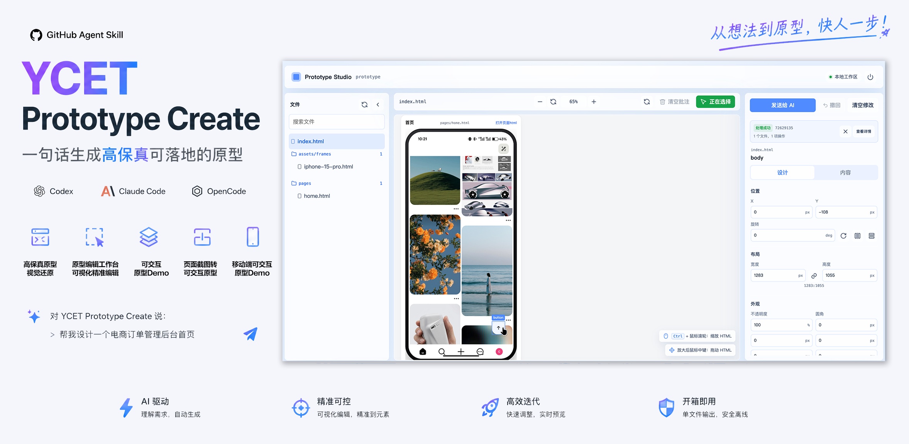
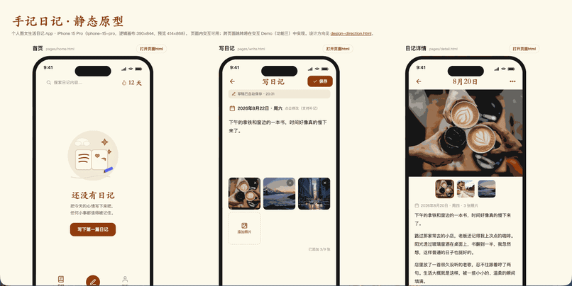
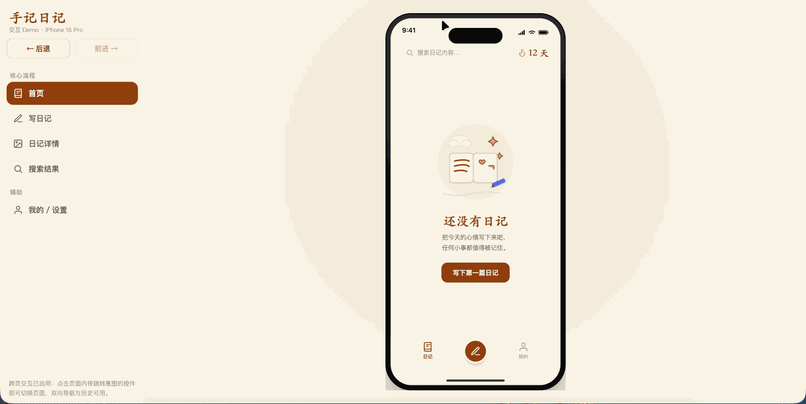
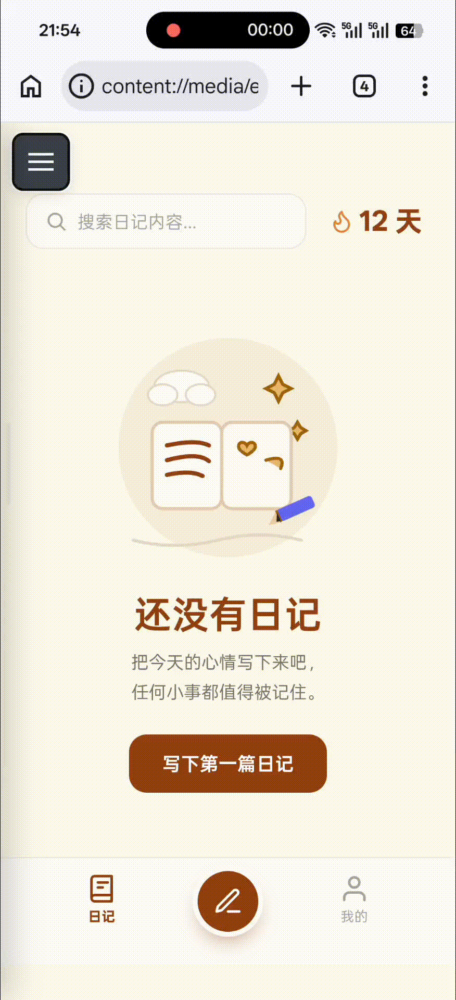

# ycet-prototype-create

把产品想法变成可独立分享的 HTML 原型，并通过本地工作台预览和修改。

覆盖需求完善、UI 方向确认、静态/带框架交互/无框架交互原型制作、既有原型重构和本地工作台。设计方向页与原型外围展示壳根据已确认的产品风格生成，不固定套用同一套视觉样式。

## 目录

- [快速开始](#快速开始)
- [功能与演示](#功能与演示)
- [交付物与独立性](#交付物与独立性)
- [修改与迭代规则](#修改与迭代规则)
- [目录结构](#目录结构)
- [校验与发布](#校验与发布)
- [文档](#文档)
- [许可证](#许可证)
- [修改任务的结束规则](#修改任务的结束规则)

## 快速开始

~~~bash
git clone https://github.com/Ycet/ycet-prototype-create.git
cd ycet-prototype-create

# 以 Codex 为例，将 Skill 目录复制到本机技能目录
mkdir -p "${CODEX_HOME:-$HOME/.codex}/skills"
cp -R skill-outputs/ycet-prototype-create "${CODEX_HOME:-$HOME/.codex}/skills/"
~~~

安装后，以自然语言描述任务，或直接调用：

~~~text
$ycet-prototype-create
~~~

对于从零开始的需求，Skill 按“需求完善 → UI 方向确认 → 原型制作”执行。每个阶段完成后都会等待用户确认，再进入下一阶段。已有原型或图片的修改任务进入功能四流程。

## 功能与演示

| 功能 | 职责 | 主要输出 |
| --- | --- | --- |
| 功能一 | 完善产品需求 | prototype/docs/Spec.md |
| 功能二 | 确认 UI 方向 | prototype/outputs/design-direction.html |
| 功能三 | 选择并制作原型 | 静态、带框架交互或无框架交互 HTML 原型 |
| 功能四 | 基于现有原型或图片重构、修改 | 更新后的原型文件与相关文档 |
| 功能五 | 启动本地原型工作台 | 可浏览和编辑当前 prototype/ 下原型的工作台 |

下列演示图展示各功能效果。动图较大，按需展开查看。

功能二 · 设计方向预览

功能三 · 静态页面

功能三 · 带框架交互 Demo

功能三 · 无框架交互 Demo

功能四 · 图片转 HTML 原型

功能五 · 原型工作台

功能三会先要求选择原型类型：

| 选项 | 类型 | 初始文件名 |
| --- | --- | --- |
| A | 静态原型页面 | prototype/outputs/prototype-pages.html |
| B | 可交互原型 demo | prototype/outputs/prototype-demo.html |
| C | 无框架交互原型 demo | prototype/outputs/prototype-nonframe.html |

C 同时适用于手机和 PC，按产品端口填满浏览器视口，长页面正常滚动。功能四处理图片时保留原图比例与视觉；HTML 整体重设计才重新确认 UI 方向，随后按 A/B/C 类型规则制作或修改。功能五的工作台直接修改现有文件，不再询问原型类型，也不再提供“同步 pages”功能。

## 交付物与独立性

所有生成的原型文件均保存在 prototype/outputs/。每份 HTML 都直接包含全部页面的 DOM、样式和交互逻辑：

- 不依赖 pages/、runtime-pages/ 或嵌套页面结构；
- 不使用 iframe、srcdoc 或外部框架文件；
- 图标、图片等资源以内联形式交付；
- 文件可单独复制、分享和在浏览器中打开。

## 修改与迭代规则

当修改涉及破坏性变更、页面新增或删除，或需要同时调整全部页面的 UI 风格、元素或交互时，Skill 会先询问：

1. 在当前原型文件上修改；或
2. 创建版本化迭代文件，例如 prototype-demo-v2.html、prototype-pages-v3.html。

原型工作台提交的修改始终直接写入当前文件，不创建迭代副本。Skill 不会自动维护 EditLog.md，也不会在不同原型类型之间同步内容。

## 目录结构

~~~text
skill-outputs/
├── ycet-prototype-create/             # 可安装的 Skill 目录
│   ├── SKILL.md
│   ├── VERSION
│   ├── docs/
│   └── scripts/
└── ycet-prototype-create-v4.2.4.skill # 打包发布物
~~~

用户任务执行时，项目内的 prototype/ 目录用于保存需求、素材和所有原型输出。

## 校验与发布

以下命令仅用于 Skill 自身开发／发布，在 skill-outputs/ycet-prototype-create/ 中执行：

~~~bash
python scripts/test_prototype_v4.py
python scripts/test_prototype_workbench.py
python scripts/validate_skill.py
~~~

可选运行时校验需要 Node.js：

~~~bash
python scripts/test_prototype_v4.py --fixtures <empty-test-directory>
node scripts/test_runtime_v4.cjs <empty-test-directory>
node scripts/test_workbench_v4.cjs <empty-test-directory>
~~~

发布前可生成发布审计报告：

~~~bash
python scripts/release_audit.py --output <output-directory>/ycet-prototype-create-v4.2.4.skill
~~~

## 文档

- [功能一：需求完善](skill-outputs/ycet-prototype-create/docs/function-1-requirements.md)
- [功能二：UI 方向确认](skill-outputs/ycet-prototype-create/docs/function-2-ui-direction.md)
- [功能三：原型制作](skill-outputs/ycet-prototype-create/docs/function-3-prototype-production.md)
- [功能四：既有原型重构与修改](skill-outputs/ycet-prototype-create/docs/function-4-existing-prototype-edit.md)
- [功能五：原型工作台](skill-outputs/ycet-prototype-create/docs/function-5-workbench.md)
- [验证说明](skill-outputs/ycet-prototype-create/docs/verification.md)

## 许可证

本项目采用 [MIT License](LICENSE)。

## 修改任务的结束规则

原型修改完成并保存后直接结束，默认不追加静态守卫、浏览器检查或局部／全量回归。仅用户明确要求测试时执行指定范围。工作台保留必要请求收尾；首次生成和 Skill 开发使用各自的验收要求。

执行约定见 [原型验证边界](skill-outputs/ycet-prototype-create/docs/prototype-validation.md)。[v4.2.4 验证记录](skill-outputs/ycet-prototype-create-v4.2.4-validation.md)说明了本版展示设计与验证范围；历史方案位于 [v4.1.0 归档](docs/spec/v4.1.0/优化执行方案.md)。
