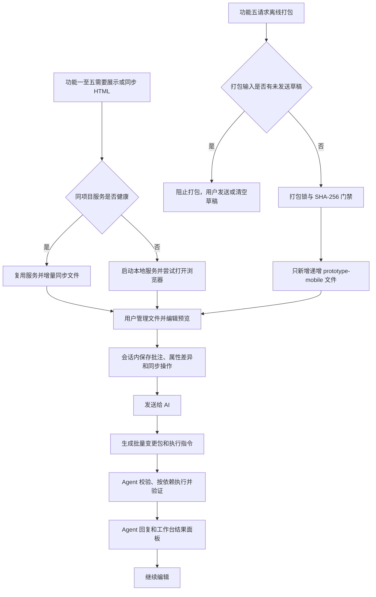

> 2026-07-19 决策同步：网页端文件栏改为只读浏览与项目扫描刷新，不再提供新增文件夹、外部 HTML 添加、删除/移出、手动分组或拖拽排序入口。外部 HTML 仅在用户明确要求时由 Agent 通过 CLI `--add` 登记；旧工作区分组和排序字段只作兼容读取。
>
> 2026-07-19 交接与生命周期同步：顶部 Power 按钮可在二次确认后优雅停止工作台进程；“发送给 AI”采用通用指令交接与持久状态跟踪，同一项目只允许一个未完成请求，不直接启动或控制特定 Agent。
>
> 2026-07-20 决策同步：移除“撤回 AI 修改”按钮以及配套的 Web 接口、CLI 命令和跨重启撤回快照。请求执行前的事务快照仍用于原子执行与冲突保护，但完成或中止后立即清理，不作为用户撤回功能。

# Agent 交接摘要

- 目标：为 `ycet-prototype-create` 的功能一至五提供本地浏览器编辑工作台，替代功能二中依赖 F12、CSS 选择器和 HTML 片段的精准定位方式，并纳入功能五的离线单文件成品预览与受控编辑。
- 已确认方案：采用“本地 HTTP 服务 + 浏览器 Web UI”；编辑器使用标准化变更包和自动生成的 Agent 执行指令交接修改，不直接控制特定 Agent 会话。
- 范围边界：网页端扫描项目内 HTML；用户明确要求时，Agent 可通过 CLI `--add` 登记外部 HTML。预览、批注、属性调整和 `同步 pages` 在发送前都不改写源 HTML；图片只支持替换，不支持图片编辑；功能五打包期间严格保持其 `prototype/` 输入只读。
- 明确不做：浏览器扩展、Electron/Tauri 打包、图片生成/修图、磁盘文件删除、未发送草稿跨重启恢复、外部 HTML 的永久执行历史、实时直接控制 Codex/Claude Code/OpenCode 会话。
- 验收标准摘要：五项功能按需启动或复用服务；可选中嵌套 iframe 与离线单文件 `srcdoc` 内组件；支持跨文件批量提交、运行时同步和部分成功反馈；功能五只新增递增的离线成品；Chrome、Edge、Firefox 中编辑器不破坏页面布局。
- 待决问题：无产品级待决问题。
- 相关计划：无

# 背景与目标

## 背景

现有功能二要求用户在浏览器开发者工具中复制 CSS 选择器和 HTML 片段，才能让 Agent 精确定位原型元素。这一流程门槛高，且用户无法像使用 Figma 一样直接查看、选择和微调组件样式。

功能一、三、四会陆续生成或迁移 `design-direction.html`、`index.html`、`pages/**/*.html`、`runtime-pages/**/*.html` 和 `prototype*.html`。功能五会基于完整运行时页新增递增的 `prototype-mobile*.html`。这些页面需要在同一个本地工作台中持续可见，而不是依赖手动打开多个文件。

## 目标

1. 建立项目级本地 Web 应用，统一展示和管理原型 HTML。
2. 允许用户在预览中精确选择元素、添加批注，并在属性区进行实时预览调整。
3. 将所有待发送页面修改汇总为结构化变更包，交由 Codex、Claude Code、OpenCode 等 Agent 按同一协议执行。
4. 保持现有功能三对静态页和运行时页的保护边界，提供受控的 `同步 pages` 能力。
5. 将功能五生成的离线单文件作为可预览、可独立编辑的成品纳入工作台，同时不破坏其打包阶段的只读输入和递增输出约束。
6. 只在用户点击“发送给 AI”后才允许 Agent 真正修改 HTML，并通过逐文件结果明确报告执行状态。

# 用户场景

1. 用户完成设计方向后，功能一启动工作台并显示 `design-direction.html`；后续静态页面和入口生成后自动加入文件栏。
2. 用户调用功能二时，工作台扫描项目已有原型页面；即使当前项目没有 `prototype/`，也会正常启动空工作区，后续生成 HTML 后可通过左栏刷新补入；网页端不提供外部 HTML 添加入口。
3. 用户在中央预览中开启元素选择，点击组件后添加批注，或在右侧调整字体、填充、圆角、尺寸等，并即时查看效果。
4. 用户在多个 HTML 文件之间切换，保留本次会话未发送的批注、属性差异和待发送 `同步 pages` 操作。
5. 用户点击“发送给 AI”，一次提交所有页面的待发送内容；Agent 反馈每个文件的成功、冲突和失败原因。
6. 用户在功能三生成 Demo 后，选中某个 `runtime-pages/*.html`，点击“同步 pages”，在发送后让 Agent 安全地将对应静态页更新合并到运行时副本。
7. 用户调用功能五时，工作台确认待打包运行时页没有未发送草稿；打包成功后自动展示新增的 `prototype-mobile*.html`，用户可将它作为独立离线成品继续批注或编辑。
8. 用户可点击顶部 Power 图标关闭当前工作台进程；有未发送草稿时先确认丢失风险，已发送或正在执行的 Agent 请求继续保留。

# 已确认需求

## 本地服务与功能集成

- V1 使用本地 HTTP 服务和浏览器 Web UI，不使用浏览器扩展或桌面壳。
- 服务只绑定本机地址；启动成功后自动打开浏览器。自动打开失败时，Skill 必须向用户提供本地 URL。
- 若同一项目的服务已健康运行，功能一、三、四、五后续生成 HTML 时只增量同步新文件，不重新启动服务。
- 用户可通过顶部 Power 图标二次确认并优雅关闭工作台。服务先响应，再停止 HTTP、监听与对话框代理并清理当前实例状态；页面保留“进程已关闭”提示。之后只有功能一至五再次需要展示或同步文件时，Skill 才重新启动服务。
- 关闭服务只清空未发送浏览器草稿，不删除已发送请求或执行结果，也不终止正在运行的 Agent CLI。
- 功能一在生成 `design-direction.html` 时启动或复用服务；后续生成 `pages/` 和 `index.html` 时增量添加。
- 功能二启动或复用服务并扫描项目 HTML；没有 `prototype/` 或没有内部 HTML 时也必须正常启动空工作区。
- 功能三生成 `runtime-pages/`、`prototype.html` 或 `prototype-vN.html` 时，服务未运行则启动，已运行则只添加新文件。
- 功能四生成、接管或迁移 HTML 后，服务未运行则启动，已运行则只添加新文件。
- 功能五在完成运行时准备或离线打包后，服务未运行则启动，已运行则只添加本次新增的 `runtime-pages/**/*.html`（仅完全缺失时允许）和 `prototype-mobile*.html`。工作台服务及 `.ycet-editor/` 配置位于 `prototype/` 外，不参与功能五对 `prototype/` 的输入 SHA-256 校验。

## 左侧文件栏与工作区

- 左侧边栏可以折叠；折叠后鼠标移至浏览器左边缘可临时展开，用户可固定为常驻展开。
- 项目内 HTML 按真实目录结构自动分类；例如 `pages/` 和 `runtime-pages/` 为目录组，根目录 `index.html`、`prototype.html`、`prototype-mobile*.html` 等不分组。
- 用户明确要求 Agent 通过 CLI `--add` 登记的外部 HTML 初始不分组，并显示“外部”来源标识；网页端不提供路径输入框或 HTML 文件选择器。
- 每组按文件名升序展示，组内文件相对文件夹标题向右缩进；网页端不提供拖拽排序或其他手动排序入口。
- 项目目录自动形成只读分组；网页端不能创建、重命名、解散分组，也不能在分组间移动文件。旧 `workspace.json` 中的手动分组只作兼容展示。
- 左侧不提供删除或移出按钮，工作台绝不删除、移动或重命名磁盘中的原始 HTML。
- 当前打开文件、缩放偏好以及 Agent 通过 CLI 登记的外部 HTML 可跨重启保留在 `.ycet-editor/workspace.json`；旧手动分组和排序字段仅兼容读取，不再通过网页修改。
- 未发送批注、属性修改和同步操作不写入 `workspace.json`。
- 功能五新增的 `prototype-mobile*.html` 显示“离线单文件”来源标识，但仍属于根级未分组项目文件，并遵循文件名升序规则。

## 预览、选择与批注

- 页面通过本地 HTTP 服务预览，不直接以 `file://` 打开。
- 服务在返回预览页面时临时注入编辑运行时和覆盖层，不写入源 HTML。
- 选择模式下，鼠标悬浮显示元素选区框、标签和尺寸；点击后显示元素层级信息。
- 编辑器覆盖层不参与元素选择。
- 嵌套 iframe 的外层、设备框架和内部产品页都使用同一运行时协议，因此可选中框架内的真实产品组件。
- `prototype-mobile*.html` 的外层通过本地 HTTP 预览；其内嵌 Base64 `srcdoc` 页面在加载后由同源编辑运行时临时注入选择协议，保证可选中实际产品组件而不写入离线成品。
- 元素定位信息必须包含目标文件、CSS 选择器、DOM 结构指纹、标签/类名/文本特征和原始文件摘要；Agent 无法唯一定位时必须报告冲突，不得猜测修改。
- 选中元素后可在附近添加批注。批注用编号标记展示，随元素滚动和布局变化重新定位；悬浮可查看、编辑或删除批注。
- 中央红框区域作为内置浏览器视口，外框在所有缩放比例下都占满全部可用宽高。支持预设与自定义百分比的浏览器式页面缩放，不改变外框或 HTML 的真实尺寸；仅在放大到 100% 以上后允许中键通过内部预览层偏移二维拖动页面内容，且不依赖页面是否存在横向滚动条。

## 右侧属性区与草稿

- 右侧属性区提供“设计”“内容”“CSS”页签。
- 设计页签按元素类型显示文本、字体、字号、颜色、填充、描边、圆角、阴影、透明度、宽高、间距、对齐和布局等控制。
- 文本元素可编辑文本内容和排版；图片元素可替换本地图片并预览；普通容器可编辑外观与布局。
- Flex/Grid 元素提供方向、对齐、间距、列数等真实布局控制；absolute/fixed 元素额外提供 X/Y 及定位边。
- 不提供图片编辑、修图或图片生成能力；V1 仅支持图片替换。
- CSS 页签允许用户添加任意 CSS 属性和值，以覆盖未列出的细项。Agent 执行时必须拒绝危险协议、外链资源、越界路径或不符合项目约束的值。
- 属性调整、文本替换、图片替换和 CSS 差异只作用于预览 DOM，发送前不写入源 HTML。
- X/Y 输入展示元素当前视口坐标，写回时以坐标差量叠加到原有 `left/top`；元素位于非零起点定位容器时，输入值增加 1 只能移动 1 CSS 像素。
- 未发送草稿只保留在当前 Web 应用会话内；用户关闭工作台后全部丢失。
- 从一个文件切换到另一个文件时，当前会话内各文件的未发送草稿必须保留。
- 对 `prototype-mobile*.html` 的草稿属于该独立离线文件；不得反向推导或同步到 `runtime-pages/`、静态页或下一次功能五输出。

## 清空、发送与执行结果

- 右侧操作区固定展示“发送给 AI”和“清空修改”。
- “清空修改”仅影响当前 HTML：清空该文件的属性区修改和待发送 `同步 pages` 操作，恢复该文件原始预览；不清空批注，不影响其他 HTML 的会话修改。
- “发送给 AI”收集当前会话中所有 HTML 的批注、属性修改、文本/图片替换、CSS 差异和同步操作，并生成一个批量标准化变更包。
- 点击“发送给 AI”后，Web 应用必须清空所有 HTML 文件的会话修改信息，包括批注、属性修改和待发送同步操作。
- 变更包为机器可读的唯一事实来源，并同时生成可复制的 Agent 执行指令。没有实时桥接适配器时，用户将该指令交给当前 Agent。
- 交接弹窗展示请求 ID、文件数、操作数、动态状态和执行指令，必须完整位于支持的视口内且不产生横向滚动；关闭按钮具有可辨识边框，和复制按钮至少间隔 12px。点击“复制指令”后立即关闭弹窗并通过 Toast 如实反馈结果；剪贴板失败时不得误报已复制，并可从请求详情重试。
- 请求动态状态独立保存为 `.state.json`，按 `pending`、`processing`、`success`、`partial`、`failed`、`aborted` 流转，工作台重启后恢复。
- 同一项目只允许一个 `pending` 或 `processing` 请求。活动请求涉及的文件锁定编辑，其他文件可准备草稿但不能再次发送；`pending` 可由用户取消且不恢复草稿，`processing` 只能由 Agent 完成或中止。
- 项目内原型文件成功修改后按现有规则更新 `prototype/docs/EditLog.md`。外部文件不写 `EditLog`，也不建立永久执行历史。
- 当同一批次中互不依赖的文件出现冲突或失败时，Agent 可以继续修改其他校验通过的文件。
- Agent 完成后必须在最终回复中说明成功文件、失败文件和失败原因；Web 应用也必须在当前会话结果面板展示同样信息。
- 发送执行中禁止再次发送新批次，以避免文件摘要和请求边界混乱。

## `runtime-pages` 同步与原型保护

- 可映射到 `pages/*.html` 的 `runtime-pages/*.html` 仅在对应静态页最近一次相关 Agent 请求成功且 SHA-256 真实变化、并且该批次尚未同步时展示“同步 pages”按钮；静态页未真实变化时不展示。
- 点击“同步 pages”只向当前运行时文件的会话草稿添加同步操作，按钮变为绿色“已同步”，中央画布即时预览源请求中可复用的样式、CSS 和文本操作；必须再点击“发送给 AI”后，Agent 才可真正修改运行时文件。
- 同步操作必须声明静态源页、运行时页、所属 Demo、源请求 ID、静态页修改后摘要和运行时文件摘要；同步请求成功后隐藏该批次入口。
- Agent 不能简单覆盖运行时文件。必须将静态页的最新结构和样式受控合并到运行时页，同时保留或重新生成功能三注入的跨页交互逻辑。
- 同步时不修改 `prototype.html`、`index.html` 和静态页；必须验证 `prototype.html` 仍可加载目标运行时页，以及 `navigate`、`set-screen`、`screen-changed` 等运行时消息仍有效。
- 某静态页与本批次中引用它的同步操作属于同一依赖组：该组要么安全成功，要么不写入；未请求同步的静态页修改不受此约束。

## 功能五离线单文件集成

- 功能五打包前，工作台必须检查本次打包会读取的 `runtime-pages/**/*.html` 及其待替换资源是否存在未发送草稿。存在时阻止打包，并要求用户先通过“发送给 AI”落实修改或清除草稿；工作台绝不自动发送、清空或将预览草稿混入打包输入。
- 功能五开始打包后，工作台进入临时“打包锁”状态：禁止向本次 `prototype/` 输入发起新的 Agent 写入；允许继续只读预览。打包锁在成功、失败或取消后解除，未发送草稿仍按会话规则保留。
- 打包器仍以功能五既有的全项目文件集合和 SHA-256 为唯一只读门禁。工作台不得修改、格式化、记录或补写 `runtime-pages/`、静态页、入口、Demo、资源、配置、Spec 或 `EditLog.md`；功能五完成时只允许新增一个递增命名的 `prototype-mobile*.html`。
- 打包成功后，工作台增量加入该离线文件并刷新预览。不得自动重打包、覆盖旧离线文件，或因其他页面随后被 Agent 修改而静默改变既有离线成品；用户需要新版时必须再次明确调用功能五。
- 离线单文件在功能五完成后回归普通工作台文件：用户可以批注和编辑，且仍仅能经“发送给 AI”实际写入。该修改标记为“成品独立修改”，不得反向同步到运行时页，也不得影响未来功能五的输入或输出选择。
- Agent 对离线单文件的普通编辑必须额外验证其仍符合功能五的自包含、页面注册表和目标白名单要求；校验失败时不写该文件并报告原因。此类普通编辑不是功能五打包动作，应按项目内变更规则记录 `EditLog.md`；只有功能五自身的打包或运行时准备保留“不写 EditLog”的例外。

## 文件监听与并发保护

- 服务监听已加入工作区的项目内和外部 HTML 文件。
- Agent 成功修改后，服务自动刷新对应预览和摘要。
- 无未发送草稿的文件被外部修改时，服务自动刷新预览和摘要。
- 存在未发送草稿的文件被外部修改时，服务不得自动覆盖预览草稿；必须显示源文件变更提示，并阻止发送旧草稿，直到用户刷新源文件并重新编辑。
- 项目内新增 HTML 自动按目录规则加入工作区；外部 HTML 始终需要用户主动添加。
- 已不存在的已登记文件标记为缺失，但不删除工作区配置。

# 范围与非范围

## 范围

- 本地 HTTP 服务、浏览器 Web UI 和项目级工作区。
- 左侧文件管理、中央预览/选择/批注、右侧属性编辑。
- 外部 HTML 的显式添加和原路径 Agent 修改。
- 标准化批量变更包、Agent 执行指令、当前会话结果面板。
- 图片替换、任意 CSS 属性预览和 Agent 校验。
- 功能一至五的服务复用、增量同步和功能二空工作区。
- `runtime-pages` 的受控 `同步 pages`。
- 功能五打包锁、草稿门禁、离线单文件自动加入与成品独立编辑。
- Chrome、Edge、Firefox 的运行时验证。

## 非范围

- 浏览器扩展、Electron/Tauri 包装或云端部署。
- 图片编辑、图片生成、修图、抠图。
- 自动直接控制任意 Agent 会话；V1 只提供变更包和执行指令。
- 删除、移动或重命名磁盘中的 HTML 文件。
- 未发送修改草稿跨重启保存。
- 外部 HTML 的永久执行历史。
- 不经用户点击“发送给 AI”直接写入源 HTML。
- 因工作台草稿、文件监听或普通页面修改自动重打包、覆盖或反向同步 `prototype-mobile*.html`。

# 方案比较与最终决策

## 方案 A

- 做法：本地 HTTP 服务提供浏览器 Web UI、项目文件访问、预览注入、文件监听和变更包。
- 优点：易于随 Skill 启动或复用；同源预览可实现元素选择；可跨 Agent、跨会话和跨项目使用；不依赖浏览器扩展。
- 代价/风险：需要管理本地服务生命周期、路径白名单、同源预览注入和请求事务数据。

## 方案 B

- 做法：使用 Electron 或 Tauri 打包为桌面应用。
- 优点：文件和系统集成更直接，可提供原生桌面体验。
- 代价/风险：打包、升级、跨平台维护和运行时体积更高。

## 方案 C

- 做法：使用浏览器扩展配合本地桥接服务。
- 优点：更接近浏览器开发者工具的原生体验。
- 代价/风险：需要扩展安装、权限管理、iframe 和本地文件兼容处理，且跨 Agent 桥接复杂。

## 最终决策

采用方案 A：本地 HTTP 服务 + 浏览器 Web UI。该服务以项目为边界管理工作区、预览和变更交接；需要展示或同步时复用健康实例，否则启动新实例。

# 设计说明

## 核心流程

### 发送与执行顺序

1. 用户在任意已登记 HTML 中产生会话级批注、属性差异或同步操作。
2. 点击“发送给 AI”后，工作台将全部待发送文件聚合为一个批次，并立即清空全部会话修改。
3. 工作台进入 `pending` 并展示可再次复制的执行指令；用户把指令粘贴到当前 Agent。
4. Agent 原子运行 `request begin`，状态转为 `processing`，然后校验所有文件路径、摘要、元素定位和 CSS 属性。
5. 对包含“静态页修改 + 同步 pages”的依赖组，Agent 先在暂存副本中应用静态变更、生成或合并运行时变更并完成验证，全部通过后才提交该组；其他独立文件可分别执行。
6. 每个独立文件或依赖组返回成功、冲突或失败状态。互不依赖的成功项可继续提交。
7. Agent 写入项目内 `EditLog` 并回传结果；工作台进入对应终态并刷新成功文件，执行事务快照随即清理。

### 功能五打包顺序

1. 功能五只读审计运行时页和可枚举依赖，并确认当前工作台中没有影响打包输入的未发送草稿。
2. 工作台进入临时打包锁；打包器对 `prototype/` 建立既有输入的文件集合与 SHA-256 基线。
3. 打包器完成内联、机械校验和最终输入复核后，原子新增唯一递增的 `prototype-mobile*.html`；不能产生第二个写入。
4. 工作台解除打包锁并增量展示新文件；打包结果写入完成说明，不更新 `EditLog.md`。
5. 后续对该离线文件的用户编辑走普通批量变更包与手机版守卫，不回写任何源运行时页。

## 模块、组件或接口边界

### 服务启动器与生命周期管理

- 以项目根目录为服务实例边界，探测健康实例后复用或启动。
- 记录本机 URL、项目根和进程生命周期；用户手动关闭后不自动重启。
- 提供受实例令牌、Host 和 Origin 校验的 `POST /api/shutdown`；网页只能关闭自身实例，不能接收任意 PID。
- 为功能一至五提供统一的“确保服务可用并同步文件”能力，并在功能五打包期间暴露临时锁状态。

### 工作区管理器

- 维护 `workspace.json`：项目文件、Agent 通过 CLI 登记的外部文件、当前页和缩放偏好，并兼容读取旧版分组与排序字段。
- 根据真实目录生成自动分组；旧版手动分组只读展示，不改变源文件位置。
- 仅对用户明确要求 Agent 通过 CLI 登记的外部 HTML 及其本地依赖提供访问，不扫描外部目录。

### 预览网关与编辑运行时

- 通过同源 HTTP 路由加载 HTML，在响应期间注入编辑运行时。
- 运行时负责元素高亮、选中、DOM 指纹、批注锚点、预览补丁和嵌套 iframe 消息中继，并能在 `prototype-mobile*.html` 的同源 `srcdoc` 子页加载后临时注入相同协议。
- 注入内容不得写入源 HTML，也不得成为可选中产品元素。

### 三栏 Web UI

- 左栏负责文件树、搜索、选择、分组折叠和项目扫描刷新，不提供添加、移出、删除或排序。
- 中栏负责页面预览、缩放、刷新、选择模式和批注标记。
- 右栏负责元素属性、内容、CSS、批注及发送/清空操作。

### 变更包与 Agent 适配层

- 批次变更包至少包含请求 ID、项目根、文件来源、路径、文件摘要、元素定位、批注、预览差异、同步操作和依赖关系。
- 同时生成简短执行指令；没有实时 Agent 桥接时由用户交给当前 Agent。
- Agent 依据变更包修改源文件，不依赖用户手工复制 CSS 选择器或 HTML 片段。
- 面向离线单文件的变更包须标记为成品独立修改；Agent 不得将其差异反向转换为运行时页改动，并须在写入前后运行手机版守卫。

### 结果反馈

- Agent 返回逐文件或逐依赖组结果；结果同时显示于 Agent 回复和工作台当前会话面板。

## 数据与状态

| 数据 | 位置 | 生命周期 |
|---|---|---|
| 工作区配置 | `.ycet-editor/workspace.json` | 跨重启保留 |
| 会话草稿 | 浏览器内存 | 关闭工作台即丢弃；发送后全部清空 |
| 待执行变更包 | `.ycet-editor/requests/` | 供 Agent 读取；完成后不作为外部永久历史保留 |
| 项目内修改日志 | `prototype/docs/EditLog.md` | 按既有 Skill 规则追加 |
| 功能五打包锁 | 服务内存 | 仅在一次打包审计、构建和结果同步期间存在；不写入 `prototype/` |

## 错误处理与边界情况

- 浏览器无法自动打开：服务继续运行，Skill 返回 URL。
- 项目中没有 `prototype/` 或没有 HTML：显示空工作区，提示用户生成 HTML 后点击刷新；网页端不提供外部 HTML 添加入口。
- 已登记文件被删除：显示“文件缺失”，保留工作区记录。
- Agent 通过 CLI 登记的外部文件路径无效、不可读或不是 HTML：CLI 拒绝添加并显示原因。
- 元素定位不唯一、文件摘要不匹配或源文件发生并发变化：不写文件，报告冲突。
- 有未发送草稿的页面外部变化：停止发送旧草稿，要求刷新后重新编辑。
- CSS 属性危险或违反项目约束：Agent 拒绝该项并说明原因。
- `同步 pages` 缺少映射、无法保留运行时逻辑或运行时验证失败：不写该依赖组，报告失败。
- 功能五所需运行时页或依赖存在未发送草稿：不启动打包，明确要求先发送或清空草稿。
- 功能五打包期间出现输入 SHA-256 变化：打包失败并保留所有既有文件，工作台解除打包锁并报告冲突。
- 对离线单文件的普通编辑破坏资源内联、注册表或目标白名单：拒绝写入并报告手机版守卫失败原因。
- 批次中独立文件失败：继续提交其他校验通过的文件，并逐项报告结果。

# 验收标准

1. 功能一至五均能按已确认规则启动或复用同项目服务，并在生成新 HTML 后增量同步，不重复重启。
2. 功能二面对无 `prototype/` 的项目时保持服务运行并提供空工作区与项目扫描刷新；网页端不显示外部文件添加入口。
3. 左栏按真实目录自动分组并按文件名升序展示，支持搜索、选择、分组折叠和刷新；不提供新增分组、外部 HTML 添加、删除/移出或排序入口。Agent 通过 CLI 登记的外部文件和缺失文件仍可只读展示。
4. 中栏可通过同源预览选中嵌套 iframe 内实际组件；选择、批注、缩放和实时属性预览不写入源 HTML。
5. 右栏可按元素类型编辑设计属性、文本、图片替换和任意 CSS 属性；不提供图片编辑功能。
6. “清空修改”只清空当前文件属性/同步草稿，保留批注；切换文件不丢失会话草稿；关闭工作台后未发送草稿丢失。
7. “发送给 AI”一次包含所有 HTML 的待发送内容并清空全部会话修改；工作台展示请求元数据、复制结果和持久状态，Agent 能依据变更包修改正确目标，无需用户提供 F12 定位信息。
8. 批次允许独立文件部分成功，Agent 最终回复和工作台结果面板均列出成功、失败和原因。
9. `同步 pages` 仅在发送后由 Agent 执行，且验证静态源页、`index.html`、`prototype.html` 未被同步操作改写，运行时消息和 Demo 交互仍有效。
10. 功能五在没有影响输入的未发送草稿时，只新增一个递增的 `prototype-mobile*.html`，不修改任何既有 `prototype/` 文件或 `EditLog.md`；成功后该文件自动出现在根级工作区。
11. 离线单文件可在工作台中选中其 `srcdoc` 内组件；其普通编辑不反向影响运行时页，并在写入前后通过手机版守卫。
12. Chrome、Edge、Firefox 中运行编辑器不会破坏原型预览布局、滚动、嵌套 iframe 或离线单文件的基本交互。
13. Power 按钮能在二次确认后优雅停止当前实例并清理 `server.json`；重新 `ensure` 可启动新实例，已发送请求和结果仍可恢复。

# 风险与约束

- 任意 HTML/CSS 的 DOM 结构与布局差异很大；定位协议必须使用多重指纹，不能只信任 CSS 选择器。
- 文件监听和多 Agent 并发会导致源文件摘要变化；旧草稿必须阻止发送，不能尝试静默合并。
- `runtime-pages` 是功能三的派生产物；同步必须保留跨页消息协议，不能以简单复制替代。
- 外部 HTML 可读写范围必须来自用户明确添加的路径；服务不得暴露任意本地目录。
- V1 不保证实时唤起任何 Agent 会话；交接可靠性依赖变更包、执行指令和 Agent 对协议的遵守。
- 功能五打包需要全项目输入摘要稳定；工作台必须将打包锁与普通“发送给 AI”写入串行化，不能把内存草稿隐式落入包中。
- 离线单文件的普通编辑与功能五打包是两个不同动作：前者只改当前成品并需手机版守卫，后者只从运行时页生成下一递增版本。
- 现有 `ycet-prototype-create` 的 Manifest、静态页保护、EditLog、资源本地化、功能五单文件只写边界和跨浏览器滚动条规则继续有效。

# 待决问题

无。

# 后续交接说明

后续 Agent 可据此设计和实现本地服务、浏览器 UI、预览运行时、文件监听、变更包协议以及功能一至五的 Skill 调用改造。

实现时必须遵守：源 HTML 在“发送给 AI”前不可被编辑器改写；外部文件只能在用户明确要求时由 Agent 通过 CLI 登记；左栏不提供新增、移出、删除、手动分组或排序入口；未发送草稿不可跨重启恢复；`同步 pages` 不可破坏功能三的运行时交互；功能五打包前必须阻止影响输入的未发送草稿，打包期间不得改写任何既有 `prototype/` 输入或 `EditLog.md`，只允许新增一个递增离线单文件。

实现时不应擅自加入图片编辑、浏览器扩展、桌面壳、永久外部文件历史、离线单文件的反向同步或特定 Agent 的直接控制能力。任何新增范围应先获得用户确认。
