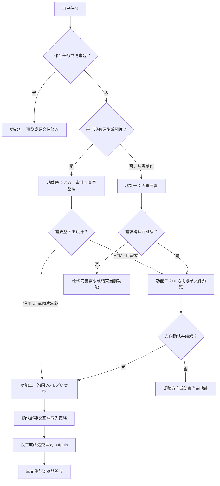

# ycet-prototype-create v4.0.0 优化执行方案

- 日期：2026-09-15
- 状态：需求已确认，待实施
- 修改对象：`skill-outputs/ycet-prototype-create/`
- 本轮交付：执行方案及现状文件审计清单；不修改 Skill 实现、不安装、不提交 Git。
- 需求依据：本次对话原始要求、16 轮讨论及其补充修订；以后出现冲突时以用户最新明确结论为准。
- 阅读顺序：先看第 1–4 节确认范围和流程，再按第 8 节实施，以第 9 节验收。

## 1. 已确认需求

| 编号 | 最终结论 |
| --- | --- |
| R01 | 功能一只负责需求完善；功能二只负责 UI 方向确认；功能三统一制作原型；功能四接管现有原型或图片；功能五启动和使用原型工作台。 |
| R02 | 从零制作默认依次执行功能一 → 功能二 → 功能三，进入下一阶段前需要用户确认；只要求单个功能时，在对应功能完成后停止。 |
| R03 | 功能三制作前必须询问原型类型，提供 A 静态原型页面、B 可交互原型 Demo、C 移动端演示原型 Demo 三个选项。原需求中的“两个选项”按实际列出的三类处理。 |
| R04 | 只生成用户选择的类型；可直接制作交互或移动端 Demo，不先生成静态原型作为中间产物。交互流程有缺口时先补充确认。 |
| R05 | 所有生成的原型 HTML 保存到 `prototype/outputs/`，包括设计方向预览及历史迭代版本。 |
| R06 | 文件基名分别为 `prototype-pages.html`、`prototype-demo.html`、`prototype-mobile.html`。三类各自独立递增；首次无后缀，新增版本取该类型最大编号加一。 |
| R07 | 三类原型的全部页面、设备框架、样式、脚本、图片、图标和必要字体内联在同一个 HTML 中。采用直接 HTML 页面容器，不使用 iframe、srcdoc 或外部页面嵌套。 |
| R08 | `design-direction.html` 同样是直接 HTML 结构的独立单文件，包含设计组件和首页预览，无独立首页 HTML、iframe 或外部依赖。 |
| R09 | 普通修改直接更新当前文件。破坏性变更、增删页面、针对全部页面同时修改时，执行前必须询问“新增迭代文件／修改现有文件”，推荐新增迭代文件。 |
| R10 | 工作台提交的修改是版本规则的明确例外：直接修改当前文件，不询问原型类型或版本策略、不生成迭代文件、不经过功能三前置选择。 |
| R11 | 三类原型独立维护，不跨类型同步。工作台“同步 pages”直接移除，不替换为其他同步功能。 |
| R12 | 功能四在实际制作前路由功能三；普通修改沿用已有 UI，整体风格调整或重设计时进入功能二确认方向；产品端口明确时沿用，仅缺失或冲突时询问。 |
| R13 | 图片原型保留完整图片承载方式，需要交互时叠加透明热区，不 OCR 还原或重建为产品页面元素；固定区域须先确认边界再分割。 |
| R14 | 工作台左侧递归展示当前 `prototype/` 下的原型 HTML，包括 `outputs/` 和历史版本，不再默认扫描整个项目。 |
| R15 | 不专门兼容旧项目；旧版多文件原型按普通外部 HTML 由功能四接管，不保留旧专用生成与同步链路。 |
| R16 | 保留 `prototype/assets/` 素材归档；交付 HTML 独立运行时不读取该目录。需求文档继续放入 `prototype/docs/`。 |
| R17 | 取消自动创建和更新 `EditLog.md`，已有日志保留；在完成回复中说明生成、修改和验证结果。 |
| R18 | 保留三类展示差异：静态多页带框架平铺；交互 Demo 左导航＋单设备框架；移动端全屏无设备壳，保留菜单与覆盖式导航。 |

第 2 问以用户追加的“全部页面同时修改”条件为准；第 8 问以工作台直接原文件修改的最终要求为准。不要恢复被后续回答替代的提问建议。

## 2. 现状分析与改造理由

本目录共 165 个文件：34 个源码／文档、116 张历史测试截图、12 个缓存／系统文件、3 个运行状态文件。完整路径、大小和 SHA-256 见[现状文件审计](ycet-prototype-create-v4.0.0-现状文件审计.md)。本轮执行了全量字节读取、文本扫描、Python 结构分析和关键实现核对；历史截图仅登记文件头及尺寸，不将其当作当前浏览器验证结果。

| 现有位置 | 已核实实现 | v4.0.0 影响 |
| --- | --- | --- |
| `SKILL.md`、五个功能文档 | 原功能一含需求、UI、静态生成；原二为工作台；原三为交互；原五为移动打包 | 重排职责、路由与阶段确认，清除旧编号引用 |
| `shared-prototype-standards.md` | 以 pages、runtime-pages、双层 iframe 和项目框架副本为契约 | 替换为直接 DOM、内联资源和单文件页面标识 |
| `build_mobile_prototype.py` | `build()` 强制读取 runtime-pages；`build_shell()` 输出全屏 iframe；页面存为 Base64 srcdoc；`choose_output()` 总是新增版本 | 不能简单改文件名；替换生成模型，资源内联和暂存验证逻辑可选择性复用 |
| `assets/frames/manifest.json` 与五个框架 HTML | Manifest 维护设备规格及 screen 路径／消息协议；框架通过 iframe 加载页面 | 保留设备数据，删除文件加载和跨窗口中继，改为构建时内联框架片段 |
| `prototype_workbench.py` | `_project_candidates()` 扫描项目根；`_record()` 根据 runtime-pages 等目录判断类型 | 扫描范围改为 prototype；类型读取内嵌元数据，不能只靠目录名 |
| 工作台 `preview-runtime.js` | 指纹包含 framePath、选择器和文本等特征 | v4 原型采用页面 ID＋稳定元素 ID 定位，增加多页面同文档隔离 |
| 工作台前后端 | sync-pages 涉及按钮、草稿、API、同步机会、依赖组与回归测试 | 全链路移除，不能只隐藏按钮 |
| `prototype_guard.py`、`validate_skill.py` | 强制校验旧路径、srcdoc、旧确认顺序和 EditLog 例外 | 按新行为重写，防止旧断言把实现拉回旧结构 |
| `release_audit.py` | 检查固定旧文件名，且拒绝 test-artifacts／pycache 进入交付包 | 更新必需清单，发布打包时排除过程文件 |

现有规则还存在需要一起消除的冲突：原功能五总是新增文件且保护全项目只读，与新覆盖规则不符；原功能四必须先静态再交互，与直接选型制作不符；“离线单文件”直接路由原功能五，在三类均离线后不再成立。

## 3. 功能与确认流程

### 3.1 路由优先级

1. 工作台请求 ID／执行指令、明确打开工作台：功能五。提交修改不进入功能三。
2. 基于现有 HTML 或整页图片制作、重构、修改：功能四。包含本 Skill 生成的单文件及普通外部 HTML。
3. 从零开始且要求完成原型：功能一 → 功能二 → 功能三。
4. 用户明确仅完善需求、仅确认 UI、或已有确认材料并要求制作：进入对应功能，检查缺失前置资料，不重复访谈已有结论。
5. 意图无法判断时，一次只询问一个路由问题。仅凭“单文件／离线”不能默认选择移动端。



图示为完整制作路径；用户明确只做需求或方向时，完成该功能即停止。确认内容相同时合并为一次有明确含义的确认，不连续重复问“是否继续”。功能三的类型选择必须取得实际回答，未回答不生成正式原型。

### 3.2 功能一：需求完善

- 保留原第一阶段的一次一问、多个答案建议、仅补缺口和需求矩阵审计。
- 保留产品逻辑与 UI 决策分离；用户提前提供 UI 偏好只记录为功能二输入。
- 需求摘要确认后生成或更新 `prototype/docs/Spec.md`，包含端口、页面、业务逻辑、边界与异常等。
- 不生成原型 HTML；用户确认进入下一阶段后交给功能二。

### 3.3 功能二：UI 方向确认

- 保留 UI Skill 发现、去重、实际可调用性说明、单个主 Skill 选择和“不使用 Skill”分支。
- 保留已存在的参考链接规则；不得编造安装状态或自动安装。
- 生成 `prototype/outputs/design-direction.html`：色彩、字体、按钮、反馈、必要组件及内联首页预览。
- 首页预览仅实现页内交互，不预生成其他正式页面。
- 用户确认方向及进入制作后，由功能三询问类型。
- 设计预览后续修改同样按第 5 节策略；其文件族单独递增，不占用三类正式原型编号。

### 3.4 功能三：原型制作

固定类型选项为：

| 选项 | 类型与基名 | 展示与行为 |
| --- | --- | --- |
| A | 静态原型页面：`prototype-pages.html` | 多页面带框架平铺；支持 Tab、表单、弹窗、筛选等页内交互；业务跨页控件仅保留目标声明，不执行跨页 |
| B | 可交互原型 Demo：`prototype-demo.html` | 左导航＋右侧单个设备框架；导航与产品点击双向同步，支持返回和错误处理 |
| C | 移动端演示原型 Demo：`prototype-mobile.html` | 全屏产品页面、无设备外壳与常驻侧栏；保留菜单、覆盖式页面导航和返回 |

类型选择后：核对页面与必要交互 → 判断现有目标与修改策略 → 展示具体输出文件和变更范围 → 生成／修改 → 验证 → 完成说明。已确认的信息直接使用；未确认的关键页面流程先一次一问补齐。

B／C 不依赖 A 的文件，也不创建 pages、runtime-pages、runtime-assets 或预备静态入口。后续制作其他类型是一项独立任务，不自动更新已有其他类型。

### 3.5 功能四：现有原型或图片接管

- 先只读读取输入与关联文件，检查当前要求及元数据中的端口。信息明确时沿用；缺失或冲突时确认，微信小程序默认宿主映射沿用 Manifest。
- HTML：提取页面、交互、资源及变更范围。首次接管直接整理 Spec 并确认；已有 Spec 时只补充变化，不重新开启完整需求访谈。
- 普通修改保留原 UI；整体风格变化或重设计进入功能二；重新设计的方向确认后再进入功能三。
- 图片：完整原图归档并内联；保留比例，长图内部滚动；只有用户明确需要固定区且边界确认后才无损分割，保存完整原图和派生片段。
- 图片不重建为产品 DOM。B／C 的点击热区默认透明，悬停／键盘聚焦显示半透明虚线轮廓；热区跟随对应固定区或滚动区。A 不绑定业务跨页热区。
- 图片已有系统 UI 与框架系统 UI 冲突时，说明具体冲突并确认处理，不自动裁图、重绘或重复叠加。
- 正式 HTML 制作之前进入功能三询问类型，不再强制“先静态交付、停止、再问交互”。
- 输入位于 outputs 外时，作为只读接管来源，新标准产物写入 outputs；已有 outputs 内标准产物按确认的目标和第 5 节修改。旧版原型不提供专用兼容流水线，不自动删除旧文件。

### 3.6 功能五：原型工作台

- 递归扫描当前项目的 `prototype/` 下 HTML；展示设计预览、三类原型、历史版本和其他现存原型 HTML，不只匹配新基名。
- 保留文件夹分组、搜索、刷新、缺失标记、新标签页打开、移出登记、侧栏折叠、空工作台和关闭进程功能。
- 刷新仅重建登记，不删除磁盘 HTML；移出仍需确认且只影响登记。缺少 prototype 时启动空工作台。
- 不默认扫描 prototype 之外的项目 HTML；既有外部登记不应自动混入新的默认列表，也不删除磁盘文件。外部原型制作按功能四处理。
- 提交操作直接修改请求中的现有文件，不进行类型或版本提问；即使内容涉及全页面，也不自动新增版本。这是用户明确指定的例外。
- 修改仍需请求包、SHA-256、唯一指纹定位、事务与验证，不能将“直接修改”理解为预览草稿自动落盘。
- 同步 pages 的控件、草稿类型、接口响应字段、同步机会计算、执行分支和专属测试全部移除；旧请求中的该操作返回明确不支持，不能解释为普通覆盖。
- 请求／状态／结果属于 `.ycet-editor/` 中的工作台必要运行数据，不属于已取消的 EditLog。保留其状态流转、部分成功与冲突处理。

## 4. 单文件实现设计

本节为落实已确认需求的技术方案，不是额外要求用户确认的产品功能。

### 4.1 目录与数据真源

```text
prototype/
  outputs/
    design-direction.html
    prototype-pages.html
    prototype-pages-v2.html
    prototype-demo.html
    prototype-mobile.html
  docs/
    Spec.md
  assets/
    images/
    icons/
    fonts/                # 使用自定义字体时归档
```

已有 EditLog 不删除，新任务不更新。`.ycet-editor/` 保持位于项目根，与 prototype 同级。构建临时文件放系统临时目录或非交付暂存路径，不生成可被扫描成原型的中间 HTML。

每个交付 HTML 内嵌构建版本、原型类型、文件版本、端口、设备配置快照和稳定页面注册表。建议使用惰性的 `application/json` 元数据；元数据不存页面文件路径作为加载目标。Spec 和 assets 用于制作与追溯，运行时不读取。

建议新增 Skill `VERSION` 文件保存 `4.0.0`，保持 Skill 名称不变；Skill 版本、产物迭代号、Manifest schemaVersion、工作台请求 schemaVersion 分开管理。

### 4.2 页面结构和隔离

- 每页直接写入唯一 `data-ycet-page-id` 页面容器，页面元素使用稳定 `data-ycet-element-id`。稳定 ID 在非重建修改中保留。
- 页面 ID 在文件内唯一，DOM `id`、label for、aria 引用、SVG 渐变与 clipPath 引用均命名空间化。
- CSS 以页面容器为作用域；重写原页面的 html／body／:root 样式到对应容器，避免一页覆盖全文件。keyframes、变量和全局工具类也审计冲突。
- JS 使用闭包／模块式封装，查询与事件绑定限定页面根；公共导航只暴露统一入口。多个页面不共享无意的全局变量。
- 原固定定位元素改为对应页面容器内定位。弹窗、浮层、滚动区域不能越过所属设备屏幕或挡住其他静态卡片。
- B／C 只展示当前页面；非活动页面隐藏且退出键盘焦点与无障碍遍历，切换时处理焦点、滚动及事件生命周期。
- 不通过 Base64 HTML、Blob 页面、object／embed 或动态加载外部文件变相恢复页面嵌套。图片／字体资源使用 data URI 不受此禁令影响。

### 4.3 设备框架

- Manifest 保留端口映射、逻辑视口、预览尺寸、缩放、安全区、系统 UI 职责和默认列数。
- 删除 screen 查询参数、allowedScreenPrefixes、项目相对路径和跨窗口消息中继字段；建议升级 Manifest schemaVersion 为 2，拒绝旧契约静默混用。
- 五种框架改为可内联的 HTML／CSS／SVG 片段；生成时把所选框架结构与配置写入交付文件，不复制为运行依赖。
- 静态卡片可重复实例化同一框架，所有实例 ID 唯一；视觉尺寸及逻辑画布沿用现有 Manifest 数据。
- A 和设计方向保持框架预览尺寸，窄屏减列／阵列滚动；B 根据可用空间等比适配单个框架，导航不随设备缩放；C 以实际可视区域和设备安全区展示，不绘制仿真系统外壳。
- 工作台为隔离预览而使用的宿主 iframe 可以保留。这不属于生成原型内部嵌套；交付文件中仍必须零 iframe。

### 4.4 导航和状态

- 用 pageId 注册表替换 sourcePath／runtimePath 双路径注册表。导航目标必须命中当前文件注册表，不能跳到其他原型文件。
- A 可以保留 `data-ycet-nav-target` 语义，但值使用页面 ID 且不绑定业务跨页行为；卡片原“打开页面html”链接替换为本文件定位／聚焦页面工具，不生成独立页面文件。
- B／C 使用同文档导航函数或事件驱动，不再使用 原型页面跨窗口 postMessage 中继。工作台的编辑消息协议是独立能力，仍保留。
- 保留导航高亮、产品按钮跳转、返回、无效目标错误；query／hash 业务参数作为已验证路由状态处理，不拼成文件路径或外链。
- file:// 下选择可运行的 hash／历史实现，不能假定 HTTP 路由可用；浏览器返回优先恢复原型内上一页，初始页之前交还浏览器。
- 建议同一打开会话内保留表单等页面状态；明确离开／重新进入钩子，避免重复绑定。跨刷新持久化仅在业务明确需要时实现，不依赖本地存储权限才能运行。

### 4.5 资源与离线保证

- 原素材归档后，实际使用的图片、SVG、字体、CSS 和 JS 全部内联。资源来源 URL 可存于不执行的溯源元数据，不能成为运行依赖。
- 检查 img／source 的 src 和 srcset、CSS url／@import、SVG use／image、字体、模块依赖、媒体和动态网络调用；不限于搜索 http 字符串。
- 不误判 SVG 命名空间 URI、普通业务文案及溯源字符串为网络请求。
- 优先原生 CSS／JS；使用框架时内联必要构建产物，不保留 CDN、动态模块路径或运行时安装要求。
- 工作台新替换的图片先进入临时上传目录；执行请求时归档并把字节内联到目标 HTML，不将临时预览 URL 写入源文件。
- 自定义字体必须可内嵌，或选择已确认的系统字体栈；不能用开发机独有字体冒充可移植效果。
- 真实后端依赖由需求阶段明确为本地演示数据或模拟行为；无法离线实现的部分报告并处理，不能静默删功能或宣称独立运行。

## 5. 修改与版本策略

### 5.1 决策表

| 入口／变化 | 写入策略 |
| --- | --- |
| 工作台请求 | 始终修改请求中的现有文件；无类型询问、无版本询问、无新增迭代文件 |
| 首次制作某一类型 | 创建对应无版本后缀的基名 |
| 普通局部修改 | 修改明确指定的现有文件，不再询问版本 |
| 破坏性变更 | 先说明具体影响，询问新增迭代文件还是修改现有文件；推荐新增 |
| 新增、删除页面 | 同上 |
| 同时修改全部页面 | 同上；包括统一 UI 风格、所有页面元素、交互，以及共用样式导致的实际全页变化 |
| 范围不明确或目标有多个候选 | 先澄清唯一目标／变化范围，不凭最新修改时间猜测 |

判断看最终影响而非代码行数。改一条公共 CSS 若影响全部页面，也属于全页面修改。单页面原型中局部按钮文案不因“页面总数为一”自动升级；应判断是否为整页／全局改造。破坏性变更指已确认布局、交互或业务行为不兼容的改变，不等于所有重构。

### 5.2 命名和保护

- 各类型扫描 `prototype/outputs/` 内精确匹配文件族，基名视为 v1。编号存在缺口时仍取最大值加一，不回填历史编号。
- 从旧版本分支新增时也使用同类型全局最大编号加一，记录完成说明中的来源版本。
- 用户选择原文件修改时保留该文件名，不顺便递增另一个类型，不自动联动设计方向页。
- 若改造涉及设计方向预览，其文件族独立处理；涉及多个将被重写的 HTML 时一次列出具体目标及策略，允许用户分别指定。
- 文件名冲突或并发变化时中止提交并报告，不静默覆盖、不擅自改选版本。
- 写入前保存目标摘要，在暂存内容完成校验后再提交；保护未列入本次变更范围的文件。不要再采用“除新增手机版之外全项目不可改”的旧规则。
- 失败不留下冒充完成的最终 HTML；清理仅限本次临时文件，不覆盖用户并发修改。

## 6. 工作台实现调整

### 6.1 文件和元素定位

- 新原型类型优先读取内嵌元数据，文件名仅作辅助；保持一个 HTML 对应一个 fileId，而不是一个逻辑页面对应一个文件。
- 请求指纹建议增加 pageId、elementId，并保留选择器、标签、文本与祖先等证据；容器外的演示工具层使用独立 scope。
- 校验文件摘要后，在对应页面容器内唯一定位。相同文字出现在不同页面不能误改；隐藏页面和页面切换后也必须能识别。
- 所有修改写回规范源 HTML，不能把浏览器产生的 DOM、临时属性或覆盖层序列化为交付源码。
- 如请求结构升级，建议 schemaVersion 为 2；旧请求提供明确不支持说明并要求从当前工作台重新提交，不能自动重解释 sync-pages。

### 6.2 保留的交互质量

保留现有：默认关闭元素选择、批注定位与边缘避让、属性实时预览、撤回草稿、清空修改与清空批注分离、图片上传、缩放和平移、复制执行指令、请求状态恢复、源文件冲突检测、逐文件部分成功和优雅关闭。新版 DOM 模型下重新验证这些能力，不因删除嵌套路径而回退。

移除“同步 pages”不等于移除 CLI `sync`。后者仍可作为不启动服务的文件登记同步命令，仅限本次合法原型文件；不得再携带内容跨文件同步含义。

### 6.3 写入边界

保留 `request show/begin/complete/abort`、摘要与依赖组。依赖组继续用于真正关联的资源／文件事务，不再为 pages 到 runtime-pages 建组。请求中图片归档等附加文件需纳入事务；EditLog 从 include 示例、自动追加逻辑与测试中移除。

在暂存的完整 HTML 中执行单文件守卫与针对性页面验证后再替换原文件。其他独立文件可部分成功，同一文件的相互依赖操作按整体校验。完成后刷新当前文件，保留其他未发送草稿。

## 7. 逐文件改造清单

以下路径均相对目标 Skill 目录。新增脚本名为本方案建议，实施中如调整必须同步所有消费者。

| 文件／目录 | 计划动作 |
| --- | --- |
| `SKILL.md` | 重写五功能路由、阶段衔接、类型选择、版本规则及工作台例外；去除旧功能编号、单任务仅单功能、日志与多文件强约束 |
| `agents/openai.yaml` | 更新描述和默认提示，覆盖五功能及独立 HTML；不改变 name 和安装方式 |
| `VERSION`（新增） | 写入 4.0.0；供发布校验读取 |
| `docs/function-1-static-prototype.md` | 拆分为 `function-1-requirements.md`，只保留需求完善 |
| `docs/function-2-ui-direction.md`（新增） | 承接原 UI 阶段，改为内联设计方向与首页预览 |
| `docs/function-3-interactive-demo.md` | 替换为 `function-3-prototype-production.md`，统一三类选择、生成及修改 |
| `docs/function-4-existing-prototype-edit.md` | 调整端口、UI 复用、图片承载、Spec 与功能三交接；移除先静态再交互 |
| `docs/function-2-precision-edit.md` | 迁为 `function-5-workbench.md`；规定原文件修改例外及 prototype 扫描范围 |
| `docs/function-5-mobile-single-file.md` | 移除独立功能入口；有效移动展示与验收要求归入功能三及类型参考文档 |
| `docs/shared-prototype-standards.md` | 重写单文件、页面 ID、DOM 隔离、内联资源、框架和目录契约 |
| `docs/shared-editlog-rules.md` | 删除规则文档及全部主动引用；不删除项目历史 EditLog |
| `docs/shared-workbench-protocol.md` | 改功能五、指纹、原文件写入、扫描边界；删除 sync-pages 与旧移动只写锁规则 |
| `docs/shared-change-policy.md`（新增） | 作为版本决策、命名、工作台例外的唯一规则来源 |
| `docs/prototype-types.md`（新增） | 记录三类展示、交互与各自验收；由功能三按需读取 |
| `assets/frames/manifest.json` | 保留设备参数，升级为直接嵌入契约，去除文件路径及消息中继字段 |
| `assets/frames/iphone-15-pro.html`、`android-pixel.html`、`ipad-pro.html`、`browser-chrome.html`、`macbook.html` | 改为内联框架模板，去 iframe、screen 加载和 postMessage；保留外观和系统 UI 数据 |
| `assets/frames/README.md` | 更新使用契约；实施修改前必须先读取用户指定 README 生成规范，无法读取则停止该文件分支 |
| `scripts/build_mobile_prototype.py` | 用统一构建器替代旧运行时打包链路；仅选择性复用资源解析，不复用 srcdoc 外壳 |
| `scripts/build_prototype.py`（新增） | 面向已确认内容生成三类单文件；支持明确目标、覆盖／新增模式、暂存校验；不自行推断业务 |
| `scripts/prototype_document.py`（新增） | 公共文档模型、页面／元素标识、元数据、资源内联与读取辅助；避免三种生成器重复实现 |
| `scripts/prototype_guard.py` | 按具体输出文件校验自包含、零 iframe、唯一 ID、导航语义、图片与版本边界 |
| `scripts/prototype_workbench.py` | 修改扫描与分类、请求结构、元素指纹和附加资源事务；删除同步机会／sync-pages 代码 |
| `assets/workbench/app.js` | 删除同步按钮及事件、草稿合并与机会状态；更新页面标识和请求字段 |
| `assets/workbench/preview-runtime.js` | 单文档页面定位、作用域与稳定标识；保留宿主编辑消息及缩放坐标转换 |
| `assets/workbench/index.html` | 移除同步控件，保留预览宿主；调整提示文案 |
| `assets/workbench/styles.css`、`icons.svg` | 清理仅同步功能使用的样式／图标，不删除其他控件共用资产 |
| `scripts/validate_skill.py` | 按新路由、文件引用、版本与新契约校验，删除强制要求旧词句的断言 |
| `scripts/release_audit.py` | 更新必需文件、VERSION 和排除规则；检查无过时引用 |
| `scripts/test_build_mobile_prototype.py` | 替换为三类生成及版本策略测试，移动相关断言保留到新版场景 |
| `scripts/test_frames_runtime.py` | 改为直接 DOM 框架和多实例验证，去双层 iframe 通信夹具 |
| `scripts/test_mobile_prototype_runtime.py` | 改为单 DOM 移动页面、导航、旋转、安全区与离线测试 |
| `scripts/test_prototype_guard.py` | 新格式正反例，覆盖动态资源、命名空间和静态业务导航限制 |
| `scripts/test_prototype_workbench.py` | prototype 递归、请求定位、图片内联、原文件例外及 sync-pages 拒绝测试；删除 EditLog 追加断言 |
| `scripts/test_workbench_runtime.py` | 保留既有编辑器交互回归，替换 runtime-pages／srcdoc 样例，新增同文件多页面场景 |
| `evals/evals.json` | 重写旧 18 个场景，补足第 9 节矩阵；不只做功能编号替换 |
| `test-artifacts/`、`scripts/__pycache__/`、`.DS_Store`、`assets/frames/.ycet-editor/` | 从正式发布包排除；开发历史文件不在本轮删除，尤其不操作未知运行进程 |

## 8. 实施顺序与完成门槛

### P0：保存基线与读取适用规范

- 核对当前用户改动，建立源码摘要基线，不覆盖并发修改。
- 修改 Skill 目录前复核安装与目录规范；修改框架 README 前读取指定 README 规范；本任务不涉及 Git 提交或安装。
- 从源码清单建立旧引用检索集合，区分 Skill 源码中的工作台 index.html 与旧原型入口 index.html，不能全局机械替换。
- 完成门槛：文件清单、规则范围和测试入口明确。

### P1：定义公共文档模型与新契约

- 先实现或定义内嵌元数据、页面／元素 ID、资源与版本模型，更新 Manifest、共享规范与变更策略。
- 明确新旧 schema 的错误提示；不引入专用旧项目适配层。
- 完成门槛：三类产物和设计方向可共用模型，运行无需读取其他文件。

### P2：实现直接 DOM 框架与三类生成

- 替换框架片段和移动 srcdoc 生成器，实现页面作用域、单文档导航、三类外壳及内联资源。
- 先用包含两页、重复按钮文字、独立表单、弹窗和真实嵌入图片的小样本验证，再扩大到各设备和长列表。
- 完成门槛：三类样本和设计方向文件可各自复制到空目录独立打开，零页面嵌套和外部依赖。

### P3：实现版本与目标保护

- 新建、原文件修改、版本递增使用统一逻辑；高影响修改的确认发生在写入之前。
- 注入同名冲突、并发摘要变化与生成失败，验证不会覆盖旧版本或留下半成品。
- 完成门槛：第 5 节决策表逐项有可运行验证或对话评估。

### P4：兼容工作台新格式

- 扫描边界先收敛到 prototype；更新 fileId＋pageId＋elementId 的定位与请求流程。
- 全面删除 sync-pages，图片写入保持内联，保留编辑器既有交互和服务安全边界。
- 完成门槛：同文件两个页面的同名元素可准确分别修改，跨页切换不丢草稿，不产生新版本或 EditLog。

### P5：重写五功能文档与评估

- 按路由和门禁拆分文档；单一规则集中维护，各功能通过明确条件引用。
- 同步提示、发布清单、校验器及评估场景，清除所有执行性旧规则。
- 完成门槛：文档链接有效；行为评估不会绕过确认或恢复旧目录输出。

### P6：验收与发布准备

- 按下一节执行机械检查、浏览器验证和对话门禁评估；失败修复后只重跑相关回归。
- 正式包排除测试截图、缓存与工作台运行状态；版本号为 4.0.0。
- 完成门槛：验收记录如实标注通过／失败／未验证，明确未安装、未发布或未提交的状态。

## 9. 验收矩阵

下列为实施阶段需要完成的验收，本轮编写方案未执行这些功能测试。

| ID | 场景 | 必须结果 |
| --- | --- | --- |
| T01 | 零到一且要求完整原型 | 一→二→三，阶段确认未回复时停止对应后续写入 |
| T02 | 只完善需求／只确认 UI | 完成对应功能，不擅自制作正式原型 |
| T03 | 已有完整确认需求 | 不重复问已明确内容，仍通过功能三类型选择 |
| T04 | 分别选择 A／B／C | 仅生成所选类型，不产生 pages、runtime-pages、runtime-assets 或 index 入口 |
| T05 | 设计方向预览 | 内含组件及首页，outputs 落点，零 iframe，复制单文件后可用 |
| T06 | 四类 HTML 结构 | 所有页面直接存在；无 srcdoc、动态 iframe 或伪装的 HTML Blob 嵌套 |
| T07 | 资源边界 | CSS、JS、图片、srcset、SVG、字体、动态请求全覆盖；来源字符串与 SVG 命名空间不误报 |
| T08 | 独立分享 | 只复制一个文件到含中文和空格的空目录，以 file:// 打开；断网后逐页及交互可用 |
| T09 | 静态页 | 多页平铺，页内交互保留；产品跨页按钮不会切换逻辑页面或离开文件 |
| T10 | 交互 Demo | 左右同步、返回、有效参数、非法目标处理；不跳向其他 HTML |
| T11 | 移动端 | 全屏无壳；菜单／抽屉／遮罩／返回可用，横竖屏适配，产品固定区正常 |
| T12 | 框架 | 五种端口均匹配 Manifest；多实例无重复 ID，系统与产品 UI 不重复 |
| T13 | DOM 隔离 | 不同页同名 ID／class／动画／变量／事件不会串页；表单和弹窗作用域正确 |
| T14 | 普通局部修改 | 更新目标原文件，不问版本、不额外生成迭代文件 |
| T15 | 三类高影响修改 | 破坏性、增删页面、全部页面同时修改各自触发版本询问；回答前不写 |
| T16 | 独立编号 | 各类型最大编号独立；缺号不回填；来源旧版本不覆盖现有新版本 |
| T17 | 覆盖选择和并发 | 用户选原文件时原路径修改；目标被外部改动时冲突，不能用新基线掩盖 |
| T18 | 图片承载 | 原图归档、HTML 内嵌、比例保持；未确认固定边界时不切图；无 OCR 重建 |
| T19 | 图片交互 | 透明热区悬停／聚焦反馈正确，随滚动／固定区定位，静态不实现业务跨页 |
| T20 | 功能四 UI 与端口 | 普通 UI 沿用；重设计经功能二；仅缺失／冲突才问端口；制作前仍选类型 |
| T21 | 旧原型 | 按普通外部 HTML 接管，不要求旧专用 runtime 链路，不自动删除来源 |
| T22 | 工作台列表 | 递归显示 prototype 全部 HTML 和历史版本；不误扫项目其他目录；空项目可用 |
| T23 | 工作台修改例外 | 包括全页面批注任务，均原文件修改；不问类型／版本、不生成 vN |
| T24 | 工作台同文件多页 | 重复按钮文案准确定位；切页后重选正确，隐藏页不误改，草稿可撤回 |
| T25 | 移除同步能力 | 无按钮、无草稿／机会接口；旧 sync-pages 请求明确拒绝；CLI 文件登记 sync 不受误删 |
| T26 | 工作台图片／字体 | 临时 URL 不写回，新增资源内联；离开工作台后的文件仍可独立运行 |
| T27 | 草稿与事务 | 草稿不改源文件；摘要冲突、唯一定位失败、依赖失败如实报告；独立文件可部分成功 |
| T28 | 日志取消 | 所有路径不创建／更新 EditLog；已有文件摘要不变；工作台必要请求状态仍正常 |
| T29 | 编辑器回归 | 选择、批注边缘避让、颜色面板、撤回、缩放／平移、刷新和关闭均保留 |
| T30 | 发布一致性 | 五功能引用与版本一致，无旧契约强制断言；正式包不含过程截图、缓存或运行状态 |

浏览器至少覆盖可用的 Chrome、Edge、Firefox。桌面交互 Demo 验证 1440×900、1280×720、1024×768 默认 100% 缩放；移动端检查多档手机宽度及横竖屏。隐藏原生滚动条同时保留滚轮、触控和键盘滚动。未实际运行的浏览器、Safari iOS／Android 真机不能标为通过；桌面模拟不冒充真机。

机械守卫与运行测试应互补：源码扫描检查明显依赖与结构，浏览器监听实际请求并触发逐页行为，不能仅靠正则表达式证明所有动态 JS 离线安全。行为评估覆盖确认门禁与路由，不能仅要求文档出现特定词句。

## 10. 风险、边界与交付说明

| 风险／边界 | 实施处理 |
| --- | --- |
| 单 DOM 下 CSS、ID 和脚本污染 | 页面作用域、唯一命名及重复组件回归；不直接拼接多个完整 HTML 文档 |
| 外部 HTML 使用复杂框架或动态网络 | 在功能四审计并重构为可离线实现；明确不支持项，不自动删业务 |
| 所有资源内嵌导致体积增大 | 按需引入图标与字体、复用文件内资源；报告实际文件大小，不擅自压坏原图 |
| 手机应用不支持直接打开 HTML | 验收以支持执行本地 HTML 的浏览器为准；如实说明系统预览器／聊天附件查看器差异，不承诺所有 App 可直接运行 |
| 全局样式修改影响范围不明显 | 变更审查按实际页面影响判断，不能只看改动文件数或行数 |
| 无日志但仍需工作台状态 | EditLog 取消，运行事务与请求结果保留；两者职责清楚分离 |
| 历史截图和运行状态混在 Skill 包 | 仅用于审计／历史参考，发布阶段排除；不自动停止未知进程或删除用户历史 |

实施完成回复必须包括：本次功能、具体 HTML 路径和用途、实际采用的版本策略、页面数与资源内联情况、验证结果和未验证项、限制及继续入口。说明取消自动日志，不再要求“EditLog 已更新”。

本方案批准的是已确认需求下的实现路径；当前任务交付止于方案文件，Skill 改造尚未执行。
