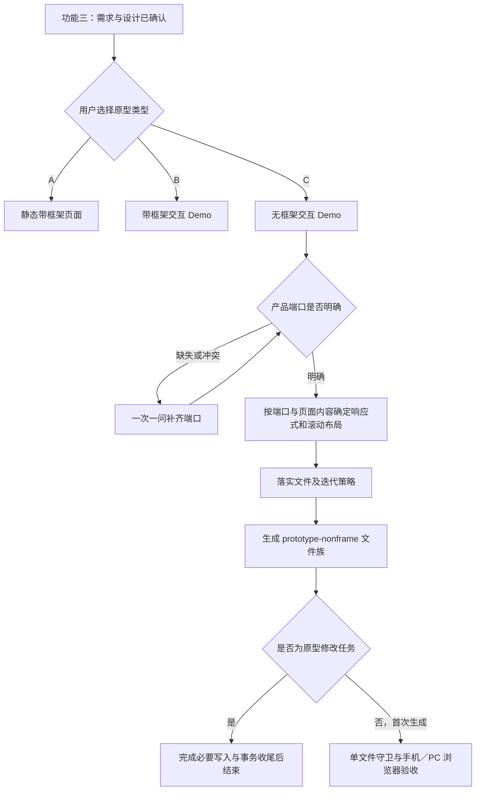

# ycet-prototype-create v4.1.0 优化执行方案

状态：2026-09-19 已完成仓库源码与 v4.1.0 发布包实施，见 [实施与验收记录](实施与验收记录.md)。基线为 v4.0.1（Git `1fee129`）；本方案保留设计决策与历史分析。全局安装未更新；未验证浏览器／真机及行为评估限制以实施记录为准。

## 1. 目标与范围

将功能三的 C 从“移动端演示原型 Demo”升级为“无框架交互原型 Demo”，统一输出 `prototype/outputs/prototype-nonframe.html`，后续版本为 `prototype-nonframe-v2.html` 等。

“无框架”指无仿真设备壳、浏览器地址栏、设备预览舞台及占用布局空间的演示侧栏。产品自身导航、标题栏、菜单和状态区仍属于产品内容。技术上继续保持直接 DOM、资源内联和单文件离线交付。

| 类型 | 输出 | 展示方式 |
| --- | --- | --- |
| A 静态原型页面 | prototype-pages.html | 带设备框架的页面平铺 |
| B 可交互原型 Demo | prototype-demo.html | 左侧页面导航、右侧带框架原型及独立缩放 |
| C 无框架交互原型 Demo | prototype-nonframe.html | 产品直接占据实际浏览器视口，按产品端口适配 |

手机端产品（iPhone、Android、移动 H5、小程序等）在手机浏览器演示；Web、桌面 App 等 PC 产品在电脑浏览器演示。平板按确认的产品设计适配其视口。产品端口决定交互与响应式设计，原型类型决定交付外观，两者独立。

阶段确认、功能四接管、工作台直接改原文件、重大变更询问迭代策略、各文件族独立编号、单文件资源契约继续有效。

## 2. 已确认的代码现状

以下是源码检查结论，不代表已经实施或运行 v4.1.0 浏览器测试。

| 位置 | 现状 | 对本次改动的影响 |
| --- | --- | --- |
| scripts/build_prototype.py：NAMES、RUNTIME、render | 使用 mobile 类型和 prototype-mobile 基名；交互判断明确包含 mobile | 名称、输出族和导航判定必须联动更新 |
| 同文件：render 的框架读取 | 全部类型先查 Manifest，默认 iphone-15-pro，并读取设备模板 | C 即使不输出外壳仍依赖框架；需要真正拆开无框架构建分支 |
| 同文件：STYLE | 页面根默认固定逻辑尺寸、overflow:hidden、contain:layout paint；mobile 只覆盖部分属性 | 存在长内容裁切及固定元素定位受限风险，不能只改类名 |
| 同文件：元数据 | 所有类型携带 frame 对象；productPort 可为空 | 无框架分支需要独立视口契约及明确端口，避免 PC 沿用手机默认值 |
| docs/function-1-requirements.md | Spec 门槛要求唯一框架 ID | 应将产品端口与框架区分；框架 ID 只服务需要框架的产物 |
| scripts/prototype_guard.py | 类型白名单只有 pages/demo/mobile/direction | 新产物会被拒绝；需新增 nonframe 并安排旧产物兼容 |
| scripts/prototype_workbench.py | 从元数据读取 kind，递归扫描 HTML；未按 mobile 文件名筛选 | 应以回归验证为主，无需新增专用扫描分支 |
| 同文件：state_paths、command_lock | 保留 mobile-pack.lock.json 与 kind=mobile-pack | 属于旧状态锁协议，不能全局替换 mobile 破坏活动状态 |
| tests、evals | 移动用例主要覆盖菜单、切页、横竖屏及宽度 | 需增加 PC、长页面、固定布局、实际可滚动到达性和空余边缘验收 |
| README.md、README_en.md | 仍写移动端类型，版本徽标仍为 v4.0.0 | 实现阶段同步更新两种语言及版本，避免入口文档落后 |

## 3. 功能流程与端口判定

保持当前五功能路由。功能三仍先询问 A/B/C，C 的名称和解释同时覆盖手机与 PC。不能因用户说“移动端”自动跳过类型确认，也不能把“无框架”解释为 PC 专用。



端口已在需求或现有文件中确认时直接沿用。手机 H5 等别名统一规范化；未知端口不得默认使用 iPhone。明确区分小程序宿主设备与产品类型，浏览器演示不冒充原生小程序运行环境。

建议在现有 Manifest 的 routing 中补齐端口别名及设备类别映射，以一处映射服务 A/B 的框架选择和 C 的设备类别识别；C 不使用其中的固定 logicalViewport、preview、safeArea 尺寸来限制输出。

## 4. 无框架显示与滚动契约

### 4.1 “完整展示”和“没有空余空间”的可验收定义

1. 产品页面根区域横向覆盖浏览器内容视口，短页面的根区域至少占满可用高度；没有设备预览舞台造成的外侧灰边、固定窄容器或缩放留白。
2. 长页面可以正常向下滚动到最后一个内容节点；“完整”不要求把所有内容压缩进首屏。
3. 产品设计中的内边距、居中阅读栏、空状态和组件间距保留；验收针对根区域未铺满和不可达内容，不以像素颜色判断空白。
4. 手机横竖屏、电脑调整窗口尺寸时布局重排；不把固定设计稿整体 transform 缩放来伪装适配。
5. 普通页面没有意外横向溢出。宽表格等确需横向滚动的内容使用局部容器，其边缘与操作保持可达。

### 4.2 两种页面布局

建议在构建输入的页面条目中增加可选 `layout`，默认 `document`，另一值为 `app`。这是实现建议，不新增用户每次都必须回答的问题；根据已确认页面结构选用。

| 布局 | 适用场景 | 行为 |
| --- | --- | --- |
| document | 网站、表单、详情、信息长页面 | width:100%，height:auto，min-height 跟随视口，文档自然纵向滚动 |
| app | 固定产品导航、工具栏、独立内容面板 | 根区域跟随视口；flex/grid 可收缩内容区；指定滚动容器 overflow:auto |

无框架样式从共享固定设备样式中隔离：移除 C 的固定逻辑尺寸、全局根裁切和根级 contain:layout paint；不靠 overflow-x:hidden 掩盖布局错误。应用式布局只有在内部滚动已可用时才约束根溢出。

宽度优先使用百分比和可收缩网格，避免根级 100vw 引入滚动条宽度问题。高度采用动态视口单位并提供旧浏览器回退；需要时由运行时统一维护可视高度，页面业务脚本仍使用 root/navigate，不放宽其全局访问约束。

安全区使用真实 env(safe-area-inset-*) 四边值；避免与产品固定栏重复叠加。手机浏览器地址栏伸缩、软键盘弹出后，输入框与提交操作应能滚动到可见区域。必要的 VisualViewport 适配只集中在运行时处理，不改变用户浏览器缩放权限。

### 4.3 导航、弹层与固定区域

保留单文档页面注册、hash 导航、返回、非法目标提示、DOM 状态保留。document 布局切页时记录／恢复相应页面滚动位置，新页面默认从顶部开始；app 布局保留各内部滚动容器状态。

继续提供可移动菜单和覆盖式页面抽屉，默认关闭、不占用产品布局。鼠标和触屏都可操作，调整窗口或旋转后菜单仍位于可见安全区域。抽屉长列表可滚动，打开时阻止背景滚动并管理焦点，关闭后恢复焦点及原滚动位置。

C 不加入 B 的独立缩放工具栏，保留浏览器原生缩放。产品固定底栏、弹窗和遮罩按实际视口／产品容器定位，并在隐藏页面退出显示与焦点遍历；不得因解除 contain 导致隐藏页固定元素泄漏。

### 4.4 图片承载边界

功能四的图片继续保持完整位图与原比例，按容器适宽，长图滚动；热区使用相同坐标转换并跟随滚动。禁止为了铺满宽高拉伸或裁剪原图。

当图片宽高比与视口不同，完整展示、保持比例、全区域铺满无法同时成立。本方案优先保持完整与比例，根背景铺满视口，允许图片自身自然留白；这不等于固定框架留下的空白。若产品要求图片也完全铺满，需要另行确认素材或重构方式，不能默默改变图片承载约定。

## 5. 构建输入、元数据与兼容策略

以下是拟采用的 v4.1.0 C 类型输入示例，尚未实现：

```json
{
  "type": "nonframe",
  "title": "网页产品演示",
  "productPort": "web",
  "initial": "home",
  "pages": [
    {"id": "home", "label": "首页", "layout": "document", "html": "<h1>首页</h1>", "css": "", "js": ""}
  ]
}
```

- C 不要求 frameId，不读取设备模板，不输出设备 CSS、仿真系统栏、框架尺寸变量或演示缩放逻辑。即使输入残留 frameId，也不用于限制 C 的尺寸，并在构建诊断中说明忽略。
- 非框架元数据采用 `type: nonframe`、`frame: null`，保留 schemaVersion 1、skillVersion、artifactVersion、productPort、initial、pages；页面元数据可增加 layout，缺省按 document 处理。
- 更新守卫，检查新类型、有效端口和 layout；旧类型继续按其原有元数据契约验证。静态守卫不宣称可以证明不存在视觉裁切。
- 新创建和新迭代仅写 nonframe 文件族，独立计算最大版本号；旧 prototype-mobile-vN 不占用新族编号。
- 为保留升级兼容，建议接受旧构建输入 `type: mobile` 作为明确的兼容别名，规范化到 nonframe 后输出新文件名并给出迁移提示。不要把未知 type 落入当前 render 的兜底分支。
- 既有 prototype-mobile 文件不批量改名或重写。功能四需要转换时先确认目标与写入策略；涉及全页布局变化仍执行版本确认。旧文件就地普通修改可直接编辑源码；完成后按第 10 节直接结束，旧契约守卫仅在用户明确要求验证时运行。
- 工作台请求始终修改包内原文件，不借此次类型更名自动新增文件或改名；新旧元数据、普通 HTML 均正常登记。
- 旧 mobile-pack 锁名保留兼容，仅作为内部历史协议；不因同名词而重命名。运行时页面类型与历史锁协议分开处理。

## 6. 逐文件影响与实施清单

下表路径除 README 和 Spec 外，均相对 `skill-outputs/ycet-prototype-create/`。标记“检查保留”的文件不要求为凑齐范围修改。

| 文件／范围 | 处理 | 内容与完成条件 |
| --- | --- | --- |
| SKILL.md | 修改 | 版本、description、C 名称；区分端口与类型，保持五功能路由和确认门槛 |
| VERSION | 修改 | 更新到 4.1.0 |
| docs/function-1-requirements.md | 修改 | 产品端口必需；框架仅为带框架预览参考，不作为 C 必需条件 |
| docs/function-2-ui-direction.md | 检查并补充 | 方向预览仍带框架；产品响应式设计不能被预览尺寸绑定；类型描述统一 |
| docs/function-3-prototype-production.md | 修改 | A/B/C 选项、C 的端口检查、布局审计及验收入口 |
| docs/function-4-existing-prototype-edit.md | 修改 | 旧 mobile 转换、固定宽高源码重构、图片比例与热区、先路由功能三 |
| docs/function-5-workbench.md | 补充 | 新旧文件类型均展示，工作台例外不变 |
| docs/shared-change-policy.md | 修改 | 新文件族与独立编号；迁移与原文件修改区别 |
| docs/shared-prototype-standards.md | 修改 | type、layout、frame:null 输入输出契约；页面固定定位和滚动分支 |
| docs/prototype-types.md | 修改 | C 的完整显示、根区域填满、响应式、滚动、菜单和图片例外作为权威展示规则 |
| docs/shared-workbench-protocol.md | 补充 | 新类型与旧类型并存；视口变化、预览指纹和原文件写入回归 |
| docs/verification.md | 修改 | 新无框架样本、手机／PC 浏览器矩阵和真实设备验收说明 |
| scripts/build_prototype.py | 修改 | 类型规范化、基名、框架分支拆分、独立 CSS、导航／滚动状态及元数据 |
| scripts/prototype_guard.py | 修改 | 新类型、端口／layout 检查和旧 mobile 验证兼容；继续执行离线守卫 |
| scripts/prototype_document.py | 检查保留 | 资源内联与图片处理复用，确认无新增外部资源路径 |
| assets/frames/manifest.json | 修改映射 | 补齐 H5／desktop-app 等端口别名和类别；保留现有设备参数及 schemaVersion 2 的兼容结构 |
| assets/frames/CONTRACT.md | 修改 | 框架规格只约束带框架类型；无框架仅复用端口分类 |
| assets/frames/五个 HTML 模板 | 检查保留 | 无框架不引用它们；A/B/direction 回归保持通过 |
| scripts/prototype_workbench.py | 检查，按失败点修改 | kind=nonframe 的扫描和请求往返；保留历史锁协议、事务与源摘要 |
| assets/workbench/app.js、preview-runtime.js | 检查，按失败点修改 | 两种滚动布局的选中、草稿预览、撤回、缩放及焦点定位；保持 important 修复 |
| assets/workbench/index.html、styles.css、icons.svg | 检查保留 | 没有专用移动类型入口；不改变工作台布局和资源 |
| scripts/test_prototype_v4.py | 修改 | 新类型、端口、两布局、无模板依赖、迭代编号和旧输入／旧产物兼容 |
| scripts/test_runtime_v4.cjs | 修改 | 增加移动与 PC 独立样本及长内容断言，不能只检查根宽度 |
| scripts/test_workbench_v4.cjs、test_prototype_workbench.py | 扩展 | 新／旧／任意文件名、页内和文档滚动后的定位及请求原文件保护 |
| scripts/test_preview_priority_v4.cjs | 检查保留 | important 修复继续通过，防止布局重构影响撤回 |
| scripts/validate_skill.py | 修改 | 版本、文档类型、构建映射与元数据契约一致性；兼容名单排除历史 mobile 合理引用 |
| scripts/release_audit.py | 检查保留 | 复用打包过滤；产物名升级 4.1.0，历史包保持原样 |
| evals/evals.json | 修改／新增 | 版本、C 的手机与 PC 场景、端口缺失、图片边界、迁移、工作台例外 |
| agents/openai.yaml | 检查保留 | 当前描述无移动专属限制，保持调用策略；如需改文案与入口同步 |
| 根目录 README.md、README_en.md | 修改 | 版本、工作流、类型表、文件示例、发布包与归档链接；执行前读取 README 生成规范 |
| docs/spec/v4.0.0/ | 已归档 | 保留旧方案与证据原文，不将历史描述替换成新版行为 |
| docs/spec/v4.1.0/ | 新版记录 | 本方案；实现后增加验收记录和 verification 证据 |

## 7. 实施顺序与完成标准

1. **统一契约。** 更新入口与类型文档，落实端口、两种布局和兼容规则；核对所有活动文档中 C 的名称一致。历史记录及兼容词允许保留 mobile。
2. **拆分构建分支。** 新建 nonframe 输出和元数据，解除设备模板依赖；生成手机、Web 和桌面 App 最小样本，守卫通过。
3. **实现响应式与滚动。** 分别验证 document/app，落实安全区、菜单、焦点、切页滚动恢复；按实际产品内容检查固定宽高，不能只依赖通用外壳修复。
4. **兼容和工作台回归。** 旧 mobile 输入规范化、旧 HTML 可验证、编号隔离、工作台原文件操作均通过；旧状态锁不被意外迁移。
5. **执行验收矩阵。** 第 8 节作为 Skill 版本开发验收；用户日常原型修改按第 10 节完成即结束，只有明确要求测试时才执行指定范围。先单元与守卫，再浏览器行为和截图检查；逐浏览器记录通过／失败／环境不可用，失败修复后只重跑受影响测试。
6. **同步并发布。** 更新 README、版本和评估场景，生成 `skill-outputs/ycet-prototype-create-v4.1.0.skill`，比对包内源码；写验收记录。安装全局 Skill、提交 Git按届时明确授权执行。

## 8. 验收矩阵

本节用于 v4.1.0 Skill 生成器、运行时和工作台实现的开发验收，不是每次用户原型修改必须全量执行的清单。日常原型修改完成后不追加验收；首次制作及显式测试边界以第 10 节为准。

| 编号 | 场景 | 通过标准 |
| --- | --- | --- |
| T01 | 手机 C：iOS、Android、H5、小程序 | nonframe 文件，正确端口，无设备壳／假系统栏／舞台，核心流程可演示 |
| T02 | PC C：Web、desktop-app、Windows、macOS | 根区域跟随电脑窗口，无手机窄画布或默认 iPhone 布局 |
| T03 | 短页面 | 根宽覆盖可用视口，高度至少覆盖可用高度，允许产品内部设计留白 |
| T04 | 长文档／长表单 | 最末节点和提交按钮可滚动到达，非首屏内容不被隐藏 |
| T05 | 应用式布局 | 顶部／底部产品栏可达，内部内容可独立滚动，无重复根滚动或意外空带 |
| T06 | 手机动态视口 | 地址栏伸缩、软键盘、横竖屏后输入及操作可见；需记录真实设备结果 |
| T07 | 电脑窗口变化 | 从大屏缩小至窄窗口再放大，内容重排且无持续裁切、溢出或空余外边缘 |
| T08 | 菜单／抽屉 | 长列表滚动、鼠标／触屏拖动、Escape／遮罩关闭、焦点及背景滚动恢复 |
| T09 | 页面导航 | 切页、后退、页面状态与滚动位置符合约定；隐藏页不占布局或遮挡 |
| T10 | 图片／热区 | 比例不变、长图完整滚动、热区命中准确；特殊比例留白如实说明 |
| T11 | 独立分享 | 单 HTML 复制到含中文与空格的目录、离线打开，资源和全部页面可用 |
| T12 | 文件族／兼容 | nonframe 最大编号加一；旧 mobile 不占新编号；旧输入有明确迁移提示 |
| T13 | 工作台 | 新旧类型和任意命名扫描、编辑预览、撤回、提交包定位正确；不新增迭代或改变源文件名 |
| T14 | A/B/direction 回归 | 设备框架、B 左侧滚动及右侧独立缩放、静态阵列和方向预览正常 |
| T15 | 发布一致性 | VERSION、SKILL 标题、生成元数据、evals、README、包名均为 4.1.0；旧版本档案保持历史语义 |

建议自动化视口：手机 320×568、375×667、390×844、430×932 及横屏；平板 768×1024；电脑 1024×768、1280×720、1440×900、1920×1080。覆盖 Chrome、Edge、Firefox 和可用 WebKit/Safari；iOS Safari、Android Chrome 真机另记，桌面模拟不能替代真机。任意浏览器均不能只靠固定截图判断滚动可达性。

测试应同时读取根区域几何尺寸、实际 scrollTop 变化、末端节点可见性及关键控件是否被遮挡。对高风险视口保留截图，所有交付页面逐页检查。图片比例等已知限制单列，不将其计作普通布局通过。

## 9. Spec 归档与当前交付

本轮把原 docs/spec 下四份 Markdown 和整个 v4.0.0-verification 目录移入 docs/spec/v4.0.0/，保持子目录相对位置，旧证据链接不变。v4.0.1 的补充验证原本归属该组，按用户指定一并归入 v4.0.0。

当前目录：

```text
docs/spec/
├── v4.0.0/
│   ├── ycet-prototype-create-v4.0.0-执行方案.md
│   ├── ycet-prototype-create-v4.0.0-现状文件审计.md
│   ├── ycet-prototype-create-v4.0.0-实施与验收记录.md
│   ├── ycet-prototype-create-v4.0.0-预览与路由补充验收.md
│   └── v4.0.0-verification/
└── v4.1.0/
    └── 优化执行方案.md
```

本轮完成标准：相关代码与文档影响已登记；需求、拟采用的实现决策、兼容边界和测试标准可区分；历史材料完整归档且链接可用；没有把规划写成已实现或已验证结果。

## 10. 原型任务轻量化执行（2026-09-18 补充）

### 10.1 问题与证据边界

用户反馈：原型修改已经可见，但 Agent 仍长期运行。提供的截图称，每次修改都会验证全部页面及核心交互，之前创建了 6 个 Playwright 套件，每个在 Chrome 中加载 9.3MB 的单文件产物。

核对当前源码与规范后，可以确认：

- `function-3-prototype-production.md` 第 5 步直接要求“在可用浏览器验证所有页面和核心交互”，没有区分首次生成与局部改动。
- `shared-prototype-standards.md` 要求复制单 HTML 后断网逐页验证，没有规定复用既有验证的条件。
- `function-5-workbench.md` 与 `shared-workbench-protocol.md` 已有“验证受影响交互”的较窄范围，但与共用标准之间缺少明确优先级。
- `verification.md` 是 Skill 开发测试命令清单，需要明确其适用对象，避免把生成器／工作台的整套测试套用到普通产品 HTML 修改。
- 当前规则缺少“规定检查通过即结束”的完成条件，可能引导 Agent 继续新建测试、重复加载或扩大截图范围。

“6 个套件”“9.3MB”及静态守卫耗时来自用户提供的截图，尚未取得对应脚本、日志或耗时记录，不能作为实测结果。反复启动浏览器、重复加载大文件、扩大验证范围是合理的耗时假设；浏览器载入时间不等于 token 消耗，token 主要还受大段文件读取、重复脚本生成、日志和截图回传影响。

优化目标是减少重复工作和无关验证，保留原有页面、交互、单文件独立性、迭代确认和工作台事务能力。以下规则适用于 A/B/C、功能四接管以及功能五修改；不是只优化无框架类型。

### 10.2 修改完成即结束：最高优先级约束（2026-09-19 修订）

> 在每一次原型修改任务中，完成用户明确要求的修改并成功保存文件后，直接结束本次任务。不得自动继续进行全量回归、局部回归、静态守卫、浏览器检查、截图比对、离线分享测试或其他验收工作。仅当用户明确要求执行验证／测试／验收时，才按其指定范围开展。

这条规则取代此前“局部修改执行 L1/L2、全局修改升级 L3”的默认验收机制。它优先于功能三、四、五及共享规范中的修改后验证要求，不得借助其他文档重新触发验收。

适用所有原型类型与修改规模：文案、样式、图片、交互、页面增删、全局 UI、公共脚本、根布局、类型转换，以及基于现有原型或图片的修改。新增迭代文件或首次接管既有原型，仍属于修改任务，不得据此按“首次生成”自动验收。

本约束不改变从零生成新原型的首次交付要求，也不取消 Skill 自身代码开发／发布的测试。必须先识别任务对象：用户修改产品原型，不等于开发 Skill 的生成器或运行时。

### 10.3 实施流程与必要收尾

原型修改流程调整为：明确用户要求及目标 → 按既有规则确认类型／版本策略 → 完成修改并保存 → 必要事务收尾 → 简短回复并结束。

- 保留执行修改所必需的源码读取、元素定位、资源内联、写入前源摘要和并发冲突保护。它们用于正确写入目标，不作为修改后的独立验收阶段。
- 同一批已授权修改集中完成；不得在每次属性调整后附加测试。
- 完成判断依据为用户要求已落实到目标内容且写入成功；不再以守卫、浏览器或回归通过作为默认结束门槛。写入失败、目标不明确或已知修改尚未完成时如实处理，不得虚报完成。
- 工作台任务按现有协议结束 request complete／abort，记录实际执行结果并释放相应事务状态。成功表示修改执行完成，不额外表示已通过浏览器或回归验证。
- 仅清理本任务启动且已不再需要的临时执行进程；保留用户正在使用的工作台服务。必要收尾完成后立即回复，不轮询等待用户查看或持续监控。
- 完成后不新建测试脚本、不运行已有测试套件、不重新截图、不重新打开浏览器，也不主动询问“是否需要再验收”来延长任务。
- 用户在同一请求中明确要求测试时，执行该项请求；只覆盖其要求的范围，不自行扩展为全量。

对修改过程中已经发生的浏览器观察，可用于定位或实现；修改完成后不追加“最终再看一遍”。不得将原本的验收任务搬到保存前、改称“必要检查”以规避约束。

### 10.4 生成器内置守卫与修改入口

当前 build_prototype.py 在构建内部调用 audit。只删除文档中的命令不足以完整落地本约束，需要在实现阶段区分首次构建与修改路径：

1. 现有 HTML 优先直接修改源码，保留稳定标识和内联资源；修改完成后不额外调用 prototype_guard.py。
2. 修改任务确需构建器生成迭代文件或完成类型转换时，提供明确的修改模式／调用参数，使该路径不隐式运行交付验收 audit，也不通过其他封装再次触发验收。
3. 首次生成默认保留原有构建守卫；Skill 开发测试仍可以显式调用 audit，避免无意取消其他任务的质量门槛。
4. 保留构建完成所需的输入解析、有效目标路径、资源读取与内联、版本选择、源摘要、原子写入及并发保护。这些写入完整性机制不属于额外验收，不能为了省时删除。
5. 在构建输出中如实区分“文件写入成功”与“已执行验证”，跳过验收的修改不得输出“守卫通过”等成功文案。

具体接口名称在实现时按现有构建 API 确定，但“修改路径不自动验收、首次构建默认行为保留”必须有明确可观察的行为。不要仅依赖 Agent 记住跳过一个被内部流程强制调用的命令。

### 10.5 上下文与输出减量

- 只读取当前功能所需规范；同一上下文已读且未变化的内容不重复加载。
- 对大单文件先提取元数据、页面 ID 和目标元素／样式／脚本片段。工具可解析完整文件，但不回传整段 Base64、字体或重复 HTML。
- 单行压缩源码按结构提取片段，避免普通搜索输出数 MB 的整行。仅减少模型读取量，不删改交付资源。
- 只修改目标及其必要依赖，不因文案、间距调整重建全部页面或重新生成素材。
- 工具返回保留修改结果与相关错误，避免全文件 diff、无关日志和重复截图。
- 完成回复简短说明改了什么、文件位置及已知限制；必要时说明“本次按约定未执行额外验收”，不声称未运行的测试通过。不创建自动 EditLog、验证缓存服务或常驻监控。

### 10.6 首次制作、显式测试与 Skill 开发的边界

| 任务 | 修改／生成完成后的行为 |
| --- | --- |
| 用户要求修改已有原型，包括全局修改、迭代与类型转换 | 保存及必要事务收尾后结束，不自动验收 |
| 用户明确要求修改并测试 | 仅执行所要求的测试范围，完成后结束 |
| 从零生成全新原型 | 保留首次交付验收，按端口选择适当浏览器／视口 |
| 开发或发布 Skill 自身代码 | 执行第 8 节对应开发验收，不套用到日常原型修改 |

拟新增 docs/prototype-validation.md 作为任务边界与显式验证的权威说明。其首条必须为“原型修改默认不追加验收”，不再保留默认 L1/L2 修改检查表。

确需验证的任务复用已有浏览器和脚本，同一最终版本的同一检查不重复执行；源文件或环境变化后旧结果不得冒充当前结果。缺少可用浏览器时如实说明，不无限安装、重试或声称通过。检查通过即交付，不继续扩大测试范围。

### 10.7 实现落点

| 文件／范围 | 必须落实的调整 |
| --- | --- |
| SKILL.md | 增加修改完成即结束的全局约束，明确优先于下游验收要求 |
| docs/prototype-validation.md（新增） | 规定修改免验收、显式测试、首次生成和 Skill 开发四类边界 |
| docs/function-3-prototype-production.md | 第 5 步仅在首次生成或显式测试时适用；修改任务完成写入后直接交付 |
| docs/function-4-existing-prototype-edit.md | 接管和改造完成后不追加浏览器、图片、热区等验收；保留实现要求 |
| docs/function-5-workbench.md、shared-workbench-protocol.md | 移除默认修改后守卫／受影响交互检查；写入后及时完成请求终态 |
| docs/shared-prototype-standards.md、prototype-types.md | 保留产物规范，所有修改后验收命令受本节约束，不得无条件触发 |
| docs/verification.md | 明确仅用于 Skill 开发；不要求日常原型修改执行其中脚本 |
| scripts/build_prototype.py | 区分首次构建和修改调用，修改模式不隐式执行验收 audit，保留原子写入与源摘要保护 |
| scripts/prototype_guard.py | 保留供首次生成、用户显式测试和 Skill 开发调用；不作为普通修改结束条件 |
| scripts/validate_skill.py | 检查入口与下游规范一致，防止残留无条件“修改后必须验证” |
| evals/evals.json | 增加小改、全局改、迭代、类型转换、工作台及时收尾和用户显式要求测试的场景 |
| v4.1.0 开发验收记录 | 记录上述行为是否落实，不为每次产品修改增加验收记录任务 |

### 10.8 约束验收标准（仅用于 Skill 实现开发）

| 编号 | 代表任务 | 预期行为 |
| --- | --- | --- |
| P01 | 修改单页标题、颜色或图片 | 保存后直接回复；不启动守卫、浏览器或测试套件 |
| P02 | 修改表单校验、导航或弹窗 | 完成指定交互修改即结束，不追加局部流程验收 |
| P03 | 全局 UI、公共脚本、根视口修改 | 遵守版本确认规则；完成修改后仍直接结束，不自动升级全量回归 |
| P04 | 新建迭代文件／转换 nonframe 类型 | 属于修改任务；构建入口不隐式触发验收，不误判为从零首次制作 |
| P05 | 工作台提交修改 | 保存原文件并结束请求状态，不停留在 processing 等待额外验收 |
| P06 | 用户明确要求“改完测试这条流程” | 仅执行指定测试，不扩展无关页面 |
| P07 | 从零生成新原型／开发 Skill | 原有对应质量门槛仍生效，防止跳过修改验收误伤其他任务 |
| P08 | 写入失败、冲突或已知需求未完成 | 如实处理或报告阻塞，不用免验收规则虚报完成 |
| P09 | 大单文件局部修改 | 不回传内联资源正文，不重建无关内容，完成即结束 |

开发时观察从“最终修改保存”到“结束回复”之间的工具调用：普通修改只允许必要文件提交／事务收尾，不得出现新增验收调用。同时检查修改路径的内置 audit 是否真正关闭、首次构建默认 audit 是否仍生效，以及写入保护是否保留。

节省时间和 token 的效果可在 Skill 开发期间对代表任务对比；不为每次用户原型修改增加性能统计或测试步骤，不承诺未经测量的降幅。本节替代 2026-09-18 方案中要求普通修改执行分级验证的内容。
