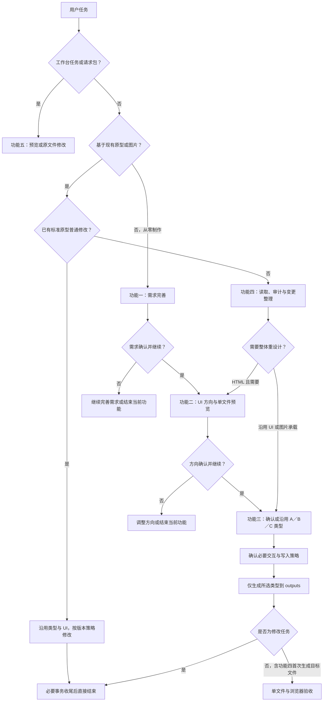

# YCET Prototype Creator v4.2.4

## 路由

按以下优先级判断触发场景，不以用户提及某个功能名或“制作原型”关键词直接跳过阶段：

1. 用户要求打开、预览或使用工作台，或提供工作台请求 ID／请求包／执行指令：读取 `docs/function-5-workbench.md`，进入功能五。请求内的原文件修改不经过功能三。
2. 非工作台的已有标准原型普通修改：读取 `docs/shared-change-policy.md` 和 `docs/prototype-validation.md`，沿用现有元数据类型及已确认 UI，定位目标后直接修改；新增页面、重设计、类型转换或首次接管仍读取功能四。资源变更或不清楚源码契约时再读 `docs/shared-prototype-standards.md`。其他用户提供现有原型 HTML、图片、截图或明确要求在其基础上制作／修改：读取 `docs/function-4-existing-prototype-edit.md`，先进入功能四读取、审计并整理变更。HTML 需要整体重设计时进入功能二；沿用 UI 或图片承载时进入功能三。
3. 非上述场景，从零提出产品想法、需求或制作原型：读取 `docs/function-1-requirements.md`，进入功能一。需求确认且用户同意继续后，读取 `docs/function-2-ui-direction.md`；方向确认且用户同意继续后，读取 `docs/function-3-prototype-production.md`。未确认时留在当前阶段完善，或按用户要求结束当前功能。
4. 续接已有任务时，仅在当前上下文有对应阶段的明确确认和继续授权后，从下一阶段恢复；不能把“开始制作”本身当作需求和 UI 方向已经确认。

产品端口与原型类型独立：C 同时适用手机和 PC，按已确认端口适配实际视口。不能只因“单文件／离线”自动选择 C。意图不明时一次只问一个路由问题，给多个答案。每个功能按需读取对应文档；仅完成用户指定阶段时不自动制作后续产物。

## 修改任务的结束条件

完成用户要求的原型修改并保存后，做必要事务收尾并立即回复。默认不追加静态守卫、局部／全量回归、浏览器检查、截图或其他验收；只有用户明确要求时执行指定范围。此规则适用于功能三／四／五、全部类型和修改规模，也适用于迭代与类型转换，优先于下游验收说明。功能四首次基于 HTML 或图片生成目标原型文件属于首次交付，保留验收，不适用修改免验收规则。读取 docs/prototype-validation.md 区分修改、首次生成及 Skill 开发。

## 全局契约

- 全部生成 HTML 位于 prototype/outputs/；Spec 在 prototype/docs/Spec.md，素材归档 prototype/assets/。
- 生成前读 docs/shared-prototype-standards.md；修改前读 docs/shared-change-policy.md。
- 所有交付 HTML 使用直接 DOM、内联资源，无 iframe/srcdoc 和外部运行依赖，包含 design-direction.html。
- 首次制作或类型转换须明确 A 静态、B 交互、C 无框架交互；当前上下文已有明确选型则沿用，否则询问并等待实际回答。已有标准原型普通修改沿用元数据类型。
- 破坏性变更、增删页面或全部页面同时修改，写入前询问版本策略，推荐新增迭代文件；普通局部修改直接改现有文件。
- 工作台请求是明确例外：原文件修改，不问类型／版本，不生成迭代文件。
- 三类原型独立维护，工作台不提供内容同步。取消自动创建／更新 EditLog，已有日志保留。
- 功能一只完善产品逻辑；UI 讨论在功能二。现有原型普通修改沿用 UI，重设计才进入功能二。端口仅缺失或冲突时询问。
- 图片保留完整位图承载，不元素化；固定区域分割先确认边界。
- 只有功能五启动工作台。其他功能不自动打开工作台、安装、发布或提交。
- 使用中文交流；关键代码中文注释。信息未知时说明，不编造资源、来源和测试结果。

## 完成

列出功能、文件、类型、版本策略、页面与资源内联情况、实际执行情况、限制及继续方式；未验收时不得声称验证通过。未实际测试的浏览器／真机明确标注，不宣称已更新日志。
